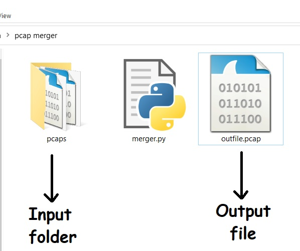

### Put the PCAP files you want to combine into the folder named "pcaps" and run the python file outside the folder.  The python script combines all the files in the folder and saves them as "outfile.pcap".

