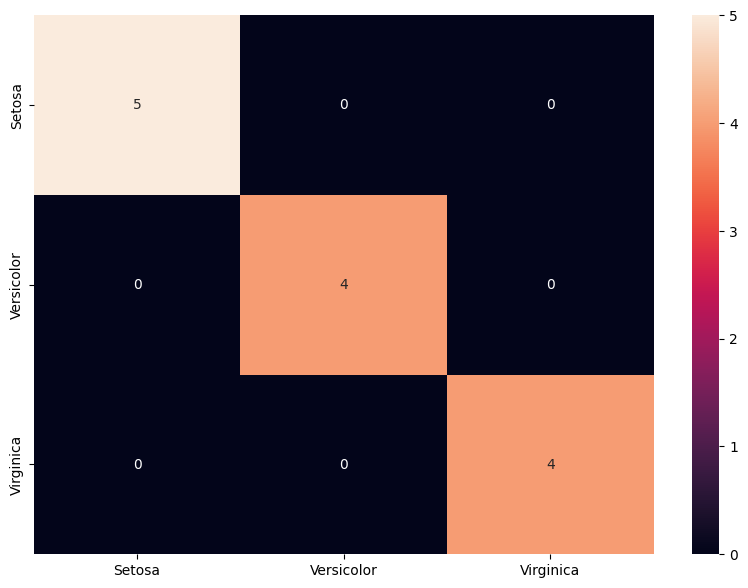
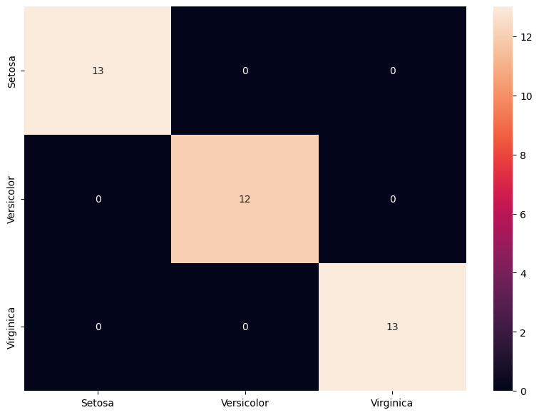
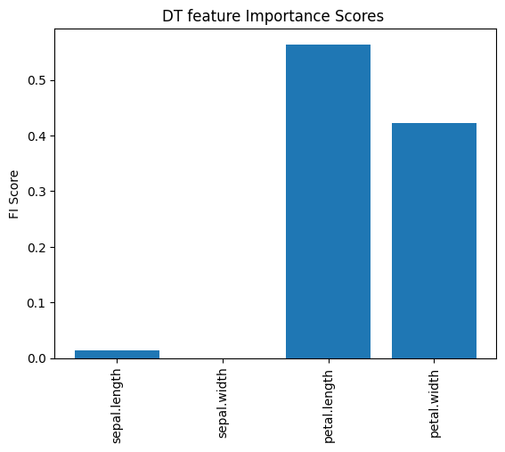

```python
import warnings
warnings.filterwarnings("ignore")
```


```python
import os
import time
import sklearn
import numpy as np
import pandas as pd
from tqdm import tqdm
from random import random
from tabulate import tabulate

import pandas as pd
import seaborn as sns
import matplotlib.pyplot as plt
%matplotlib inline
from sklearn.tree import DecisionTreeClassifier
evaluate={'Acc':"Accuracy", 'b_Acc':"Balanced Accuracy", 'F1':"F1 Score", 'kap':"Kappa", 'ROC':"Roc"}
```


```python
from sklearn.svm import SVC
from xgboost import XGBClassifier
from sklearn.naive_bayes import BernoulliNB
from sklearn.neighbors import KNeighborsClassifier
from sklearn.linear_model import LogisticRegression
from sklearn.tree import DecisionTreeClassifier
from sklearn.metrics import accuracy_score

```


```python

```


```python

```


```python
def folder(f_name): #this function creates a folder named "attacks" in the program directory.
    try:
        if not os.path.exists(f_name):
            os.makedirs(f_name)
    except OSError:
        print ("The folder could not be created!")
```


```python
def find_the_way(path,file_format,con=""):
    files_add = []
    # r=root, d=directories, f = files
    for r, d, f in os.walk(path):
        for file in f:
            if file_format in file:
                if con in file:
                    files_add.append(os.path.join(r, file))  
            
    return files_add
path="./"
csv_list=find_the_way(path,".csv")
csv_list
```


    ['./iris.csv']


# SPLIT DATA as TRAIN AND TEST


```python
for name in csv_list:   
    print(name)
    df=pd.read_csv(name)#,header=None) 
    X =df[df.columns[0:-1]]
    df[df.columns[-1]] = df[df.columns[-1]].astype('category')
    y=df[df.columns[-1]]

    # setting up testing and training sets
    X_train, X_test, y_train, y_test = sklearn.model_selection.train_test_split(X, y, test_size=0.25, random_state=27,stratify=y)

    # concatenate our training data back together
    train = pd.concat([X_train, y_train], axis=1)


    file=f"{name[0:-4]}_train.csv"
    

    train.to_csv(file,index=False)


    test= pd.concat([X_test, y_test], axis=1)

    file=name[0:-4]+"_"+"test.csv"
    test.to_csv(file.replace("train","test"),index=False)
```

    ./iris.csv
    


```python
ml_list={"DT":DecisionTreeClassifier()}#,"SVC":SVC()}}
```


```python
def target_name(name):
    df = pd.read_csv(name)
    target_names=sorted(list(df[df.columns[-1]].unique()))
    return target_names
```


```python
folder("results")
```

## Calculation of evaluations


```python
def score(train_time,test_time,predict,y_test,class_based_results,repeat,cv,dname,ml,sw):
    train_time=train_time[0]
    test_time=test_time[0]
    rc=sklearn.metrics.recall_score(y_test, predict,average= "macro")
    pr=sklearn.metrics.precision_score(y_test, predict,average= "macro")
    f_1=sklearn.metrics.f1_score(y_test, predict,average= "macro")     
    accuracy=sklearn.metrics.accuracy_score(y_test, predict)
    accuracy_b=sklearn.metrics.balanced_accuracy_score( y_test,predict)
    kappa=sklearn.metrics.cohen_kappa_score(y_test, predict,labels=None, weights=None, sample_weight=None)
    try:
        roc=sklearn.metrics.roc_auc_score(y_test, predict)
    except:roc=np.nan
    report = sklearn.metrics.classification_report(y_test, predict, target_names=target_names,output_dict=True)
    cr = pd.DataFrame(report).transpose()
    line=[dname,sw,repeat,cv,ml,accuracy,accuracy_b,pr,rc,f_1,kappa,roc,train_time,test_time]

    if class_based_results.empty:
        class_based_results =cr
    else:
        class_based_results = class_based_results.add(cr, fill_value=0)
    return class_based_results,line
```


```python
def ML_CV(loop1,output_csv,cols,dname):
    fold=10
    repetition=10
    sw=np.nan
    for ii in ml_list:
        class_based_results=pd.DataFrame()#"" #pd.DataFrame(0, index=np.arange((len(target_names)+3)), columns=["f1-score","precision","recall","support"])
        cm=pd.DataFrame()
        cv=0
        lines=[["Dataset","SW","T","CV","ML","Acc","b_Acc","Prec","Rec","F1","kap","ROC","tra-T","test-T"]]
        cm = pd.DataFrame()
        for i in range(repetition):

            rnd = random()
            
            kfold = sklearn.model_selection.KFold(n_splits=fold, shuffle=True, random_state=int(rnd*100))  
            cv=0
            df = pd.read_csv(loop1,usecols=cols)#,index_col=0)#,header=None )
            #df = df.reset_index(drop=True)
            df=df.fillna(0)

            #del df["MAC"] # if dataset has MAC colomn please uncomment this line
            X =df[df.columns[0:-1]]
            X=np.array(X)
            df[df.columns[-1]] = df[df.columns[-1]].astype('category')
            y=df[df.columns[-1]].cat.codes  
            X.shape
            for train_index, test_index in kfold.split(X):


                X_train, X_test = X[train_index], X[test_index]
                y_train, y_test = y[train_index], y[test_index]  

      


                #dname=loop1  [6:-13]  
                results_y=[]
                cv+=1
                results_y.append(y_test)


                precision=[]
                recall=[]
                f1=[]
                accuracy=[]
                train_time=[]
                test_time=[]
                total_time=[]
                kappa=[]
                accuracy_b=[]

                    #machine learning algorithm is applied in this section
                clf = ml_list[ii]#choose algorithm from ml_list dictionary
                second=time.time()
                clf.fit(X_train, y_train)
                train_time.append(float((time.time()-second)) )
                second=time.time()
                predict =clf.predict(X_test)
                test_time.append(float((time.time()-second)) )
    
                altime=0
                class_based_results,line=score(train_time,test_time,predict,y_test,class_based_results,cv,i,dname,ii,sw)
                lines.append(line)

                
                
                
                
                df_cm = pd.DataFrame(sklearn.metrics.confusion_matrix(y_test, predict))
                if cm.empty:
                    cm =df_cm
                else:
                    cm = cm.add(df_cm, fill_value=0)
                
                
                
                
                
        results = pd.DataFrame (lines[1:], columns = lines[0])
        results.to_csv(output_csv.replace("ML",ii),index=False)
        results=results.round(3)
        print (tabulate(results, headers=list(results.columns)))
        #print()
        if True:
            cm=cm//(repetition*cv)
            graph_name=output_csv[:-4]+"_confusion matrix.pdf"   
            plt.figure(figsize = (10,7))
            sns.heatmap(cm,xticklabels=target_names, yticklabels=target_names, annot=True, fmt='g')
            plt.savefig(graph_name,bbox_inches='tight')#, dpi=400)
            plt.show()
            #print(cm)
            print("\n\n\n")             


```

# 10 fold 10 times Cross-Validating


```python
feature=["sepal.length","sepal.width","petal.length","petal.width","variety"]
```


```python
train="iris.csv"
output_csv="results_CV.csv"
target_names=target_name(train)
dname="IRIS_10X10_CV"
```


```python
ML_CV(train,output_csv,feature,dname)   
```

        Dataset          SW    T    CV  ML      Acc    b_Acc    Prec    Rec     F1    kap    ROC    tra-T    test-T
    --  -------------  ----  ---  ----  ----  -----  -------  ------  -----  -----  -----  -----  -------  --------
     0  IRIS_10X10_CV   nan    1     0  DT    0.933    0.952   0.917  0.952  0.927  0.897    nan    0.001         0
     1  IRIS_10X10_CV   nan    2     0  DT    1        1       1      1      1      1        nan    0.001         0
     2  IRIS_10X10_CV   nan    3     0  DT    1        1       1      1      1      1        nan    0             0
     3  IRIS_10X10_CV   nan    4     0  DT    0.933    0.963   0.933  0.963  0.943  0.884    nan    0             0
     4  IRIS_10X10_CV   nan    5     0  DT    1        1       1      1      1      1        nan    0             0
     5  IRIS_10X10_CV   nan    6     0  DT    1        1       1      1      1      1        nan    0             0
     6  IRIS_10X10_CV   nan    7     0  DT    1        1       1      1      1      1        nan    0             0
     7  IRIS_10X10_CV   nan    8     0  DT    0.8      0.821   0.811  0.821  0.812  0.694    nan    0             0
     8  IRIS_10X10_CV   nan    9     0  DT    0.867    0.875   0.875  0.875  0.875  0.779    nan    0             0
     9  IRIS_10X10_CV   nan   10     0  DT    0.933    0.933   0.944  0.933  0.933  0.9      nan    0             0
    10  IRIS_10X10_CV   nan    1     1  DT    1        1       1      1      1      1        nan    0.016         0
    11  IRIS_10X10_CV   nan    2     1  DT    1        1       1      1      1      1        nan    0             0
    12  IRIS_10X10_CV   nan    3     1  DT    0.933    0.917   0.933  0.917  0.915  0.896    nan    0             0
    13  IRIS_10X10_CV   nan    4     1  DT    1        1       1      1      1      1        nan    0             0
    14  IRIS_10X10_CV   nan    5     1  DT    0.933    0.952   0.917  0.952  0.927  0.897    nan    0             0
    15  IRIS_10X10_CV   nan    6     1  DT    0.867    0.905   0.917  0.905  0.897  0.783    nan    0             0
    16  IRIS_10X10_CV   nan    7     1  DT    0.933    0.917   0.917  0.917  0.905  0.891    nan    0             0
    17  IRIS_10X10_CV   nan    8     1  DT    0.933    0.889   0.952  0.889  0.908  0.894    nan    0             0
    18  IRIS_10X10_CV   nan    9     1  DT    1        1       1      1      1      1        nan    0             0
    19  IRIS_10X10_CV   nan   10     1  DT    0.867    0.905   0.917  0.905  0.897  0.783    nan    0             0
    20  IRIS_10X10_CV   nan    1     2  DT    1        1       1      1      1      1        nan    0             0
    21  IRIS_10X10_CV   nan    2     2  DT    1        1       1      1      1      1        nan    0             0
    22  IRIS_10X10_CV   nan    3     2  DT    1        1       1      1      1      1        nan    0             0
    23  IRIS_10X10_CV   nan    4     2  DT    0.933    0.933   0.952  0.933  0.937  0.898    nan    0             0
    24  IRIS_10X10_CV   nan    5     2  DT    1        1       1      1      1      1        nan    0             0
    25  IRIS_10X10_CV   nan    6     2  DT    0.867    0.889   0.867  0.889  0.85   0.8      nan    0             0
    26  IRIS_10X10_CV   nan    7     2  DT    0.867    0.861   0.861  0.861  0.861  0.797    nan    0.001         0
    27  IRIS_10X10_CV   nan    8     2  DT    1        1       1      1      1      1        nan    0             0
    28  IRIS_10X10_CV   nan    9     2  DT    0.867    0.867   0.867  0.867  0.867  0.8      nan    0             0
    29  IRIS_10X10_CV   nan   10     2  DT    0.933    0.952   0.952  0.952  0.949  0.891    nan    0.001         0
    30  IRIS_10X10_CV   nan    1     3  DT    0.867    0.889   0.867  0.889  0.85   0.8      nan    0.001         0
    31  IRIS_10X10_CV   nan    2     3  DT    1        1       1      1      1      1        nan    0             0
    32  IRIS_10X10_CV   nan    3     3  DT    1        1       1      1      1      1        nan    0             0
    33  IRIS_10X10_CV   nan    4     3  DT    0.933    0.958   0.944  0.958  0.947  0.889    nan    0             0
    34  IRIS_10X10_CV   nan    5     3  DT    1        1       1      1      1      1        nan    0             0
    35  IRIS_10X10_CV   nan    6     3  DT    1        1       1      1      1      1        nan    0             0
    36  IRIS_10X10_CV   nan    7     3  DT    1        1       1      1      1      1        nan    0             0
    37  IRIS_10X10_CV   nan    8     3  DT    0.933    0.952   0.944  0.952  0.944  0.896    nan    0             0
    38  IRIS_10X10_CV   nan    9     3  DT    0.933    0.833   0.933  0.833  0.852  0.877    nan    0             0
    39  IRIS_10X10_CV   nan   10     3  DT    0.933    0.889   0.958  0.889  0.911  0.891    nan    0             0
    40  IRIS_10X10_CV   nan    1     4  DT    1        1       1      1      1      1        nan    0             0
    41  IRIS_10X10_CV   nan    2     4  DT    1        1       1      1      1      1        nan    0             0
    42  IRIS_10X10_CV   nan    3     4  DT    0.933    0.952   0.933  0.952  0.937  0.898    nan    0             0
    43  IRIS_10X10_CV   nan    4     4  DT    0.933    0.952   0.933  0.952  0.937  0.898    nan    0             0
    44  IRIS_10X10_CV   nan    5     4  DT    0.867    0.841   0.841  0.841  0.841  0.789    nan    0             0
    45  IRIS_10X10_CV   nan    6     4  DT    0.933    0.933   0.944  0.933  0.933  0.9      nan    0             0
    46  IRIS_10X10_CV   nan    7     4  DT    1        1       1      1      1      1        nan    0             0
    47  IRIS_10X10_CV   nan    8     4  DT    0.867    0.767   0.767  0.767  0.767  0.773    nan    0             0
    48  IRIS_10X10_CV   nan    9     4  DT    0.933    0.944   0.952  0.944  0.944  0.896    nan    0             0
    49  IRIS_10X10_CV   nan   10     4  DT    1        1       1      1      1      1        nan    0             0
    50  IRIS_10X10_CV   nan    1     5  DT    0.933    0.889   0.963  0.889  0.914  0.885    nan    0             0
    51  IRIS_10X10_CV   nan    2     5  DT    1        1       1      1      1      1        nan    0.001         0
    52  IRIS_10X10_CV   nan    3     5  DT    0.933    0.958   0.917  0.958  0.93   0.894    nan    0             0
    53  IRIS_10X10_CV   nan    4     5  DT    1        1       1      1      1      1        nan    0             0
    54  IRIS_10X10_CV   nan    5     5  DT    0.933    0.958   0.889  0.958  0.911  0.891    nan    0.001         0
    55  IRIS_10X10_CV   nan    6     5  DT    0.933    0.952   0.944  0.952  0.944  0.896    nan    0             0
    56  IRIS_10X10_CV   nan    7     5  DT    1        1       1      1      1      1        nan    0             0
    57  IRIS_10X10_CV   nan    8     5  DT    1        1       1      1      1      1        nan    0             0
    58  IRIS_10X10_CV   nan    9     5  DT    1        1       1      1      1      1        nan    0             0
    59  IRIS_10X10_CV   nan   10     5  DT    1        1       1      1      1      1        nan    0             0
    60  IRIS_10X10_CV   nan    1     6  DT    0.867    0.833   0.833  0.833  0.833  0.792    nan    0.001         0
    61  IRIS_10X10_CV   nan    2     6  DT    1        1       1      1      1      1        nan    0             0
    62  IRIS_10X10_CV   nan    3     6  DT    1        1       1      1      1      1        nan    0.001         0
    63  IRIS_10X10_CV   nan    4     6  DT    1        1       1      1      1      1        nan    0             0
    64  IRIS_10X10_CV   nan    5     6  DT    0.867    0.878   0.878  0.878  0.878  0.797    nan    0.001         0
    65  IRIS_10X10_CV   nan    6     6  DT    1        1       1      1      1      1        nan    0             0
    66  IRIS_10X10_CV   nan    7     6  DT    0.933    0.952   0.933  0.952  0.937  0.898    nan    0             0
    67  IRIS_10X10_CV   nan    8     6  DT    0.933    0.889   0.952  0.889  0.908  0.894    nan    0             0
    68  IRIS_10X10_CV   nan    9     6  DT    0.933    0.917   0.944  0.917  0.922  0.898    nan    0             0
    69  IRIS_10X10_CV   nan   10     6  DT    0.933    0.958   0.944  0.958  0.947  0.889    nan    0.016         0
    70  IRIS_10X10_CV   nan    1     7  DT    1        1       1      1      1      1        nan    0             0
    71  IRIS_10X10_CV   nan    2     7  DT    0.933    0.963   0.944  0.963  0.95   0.877    nan    0             0
    72  IRIS_10X10_CV   nan    3     7  DT    0.933    0.944   0.917  0.944  0.922  0.898    nan    0             0
    73  IRIS_10X10_CV   nan    4     7  DT    0.933    0.944   0.917  0.944  0.922  0.898    nan    0             0
    74  IRIS_10X10_CV   nan    5     7  DT    1        1       1      1      1      1        nan    0             0
    75  IRIS_10X10_CV   nan    6     7  DT    1        1       1      1      1      1        nan    0             0
    76  IRIS_10X10_CV   nan    7     7  DT    1        1       1      1      1      1        nan    0             0
    77  IRIS_10X10_CV   nan    8     7  DT    0.8      0.821   0.811  0.821  0.812  0.694    nan    0             0
    78  IRIS_10X10_CV   nan    9     7  DT    1        1       1      1      1      1        nan    0             0
    79  IRIS_10X10_CV   nan   10     7  DT    1        1       1      1      1      1        nan    0             0
    80  IRIS_10X10_CV   nan    1     8  DT    1        1       1      1      1      1        nan    0             0
    81  IRIS_10X10_CV   nan    2     8  DT    1        1       1      1      1      1        nan    0             0
    82  IRIS_10X10_CV   nan    3     8  DT    1        1       1      1      1      1        nan    0             0
    83  IRIS_10X10_CV   nan    4     8  DT    0.867    0.867   0.917  0.867  0.869  0.795    nan    0             0
    84  IRIS_10X10_CV   nan    5     8  DT    0.933    0.944   0.889  0.944  0.903  0.893    nan    0             0
    85  IRIS_10X10_CV   nan    6     8  DT    0.8      0.8     0.889  0.8    0.79   0.69     nan    0.001         0
    86  IRIS_10X10_CV   nan    7     8  DT    0.8      0.811   0.821  0.811  0.812  0.694    nan    0             0
    87  IRIS_10X10_CV   nan    8     8  DT    1        1       1      1      1      1        nan    0             0
    88  IRIS_10X10_CV   nan    9     8  DT    0.933    0.933   0.933  0.933  0.926  0.899    nan    0             0
    89  IRIS_10X10_CV   nan   10     8  DT    0.933    0.952   0.889  0.952  0.908  0.894    nan    0             0
    90  IRIS_10X10_CV   nan    1     9  DT    0.933    0.952   0.917  0.952  0.927  0.897    nan    0             0
    91  IRIS_10X10_CV   nan    2     9  DT    1        1       1      1      1      1        nan    0             0
    92  IRIS_10X10_CV   nan    3     9  DT    1        1       1      1      1      1        nan    0             0
    93  IRIS_10X10_CV   nan    4     9  DT    0.933    0.963   0.933  0.963  0.943  0.884    nan    0             0
    94  IRIS_10X10_CV   nan    5     9  DT    1        1       1      1      1      1        nan    0             0
    95  IRIS_10X10_CV   nan    6     9  DT    1        1       1      1      1      1        nan    0             0
    96  IRIS_10X10_CV   nan    7     9  DT    1        1       1      1      1      1        nan    0             0
    97  IRIS_10X10_CV   nan    8     9  DT    0.8      0.821   0.811  0.821  0.812  0.694    nan    0             0
    98  IRIS_10X10_CV   nan    9     9  DT    0.867    0.875   0.875  0.875  0.875  0.779    nan    0             0
    99  IRIS_10X10_CV   nan   10     9  DT    0.933    0.933   0.944  0.933  0.933  0.9      nan    0             0
    


    

    


    
    
    
    
    

# seperated train test


```python
def ML(loop1,loop2,output_csv,cols,dname):
    fold=5
    repetition=100
    sw=np.nan
    for ii in ml_list:
        class_based_results=pd.DataFrame()#"" #pd.DataFrame(0, index=np.arange((len(target_names)+3)), columns=["f1-score","precision","recall","support"])
        cm=pd.DataFrame()
        cv=0
        lines=[["Dataset","SW","T","CV","ML","Acc","b_Acc","Prec","Rec","F1","kap","ROC","tra-T","test-T"]]
        cm = pd.DataFrame()
        for i in range(repetition):

            #rnd = random()
            
            #kfold = sklearn.model_selection.KFold(n_splits=fold, shuffle=True, random_state=int(rnd*100))  
            cv=0
            df = pd.read_csv(loop1,usecols=cols)#,header=None )
            df=df.fillna(0)
            X_train =df[df.columns[0:-1]]
            X_train=np.array(X_train)
            df[df.columns[-1]] = df[df.columns[-1]].astype('category')
            y_train=df[df.columns[-1]].cat.codes  


            df = pd.read_csv(loop2,usecols=cols)#,header=None )
            df=df.fillna(0)
            X_test =df[df.columns[0:-1]]
            X_test=np.array(X_test)
            df[df.columns[-1]] = df[df.columns[-1]].astype('category')
            y_test=df[df.columns[-1]].cat.codes  


      


            #dname=loop1  [6:-13]  
            results_y=[]
            cv+=1
            results_y.append(y_test)


            precision=[]
            recall=[]
            f1=[]
            accuracy=[]
            train_time=[]
            test_time=[]
            total_time=[]
            kappa=[]
            accuracy_b=[]

                #machine learning algorithm is applied in this section
            clf = ml_list[ii]#choose algorithm from ml_list dictionary
            second=time.time()
            clf.fit(X_train, y_train)
            train_time.append(float((time.time()-second)) )
            second=time.time()
            predict =clf.predict(X_test)
            test_time.append(float((time.time()-second)) )

            altime=0
            class_based_results,line=score(train_time,test_time,predict,y_test,class_based_results,cv,i,dname,ii,sw)
            lines.append(line)


            df_cm = pd.DataFrame(sklearn.metrics.confusion_matrix(y_test, predict))
            if cm.empty:
                cm =df_cm
            else:
                cm = cm.add(df_cm, fill_value=0)


                
                
        results = pd.DataFrame (lines[1:], columns = lines[0])
        results.to_csv(output_csv.replace("ML",ii),index=False)
        results=results.round(3)
        print (tabulate(results, headers=list(results.columns)))
        #print()
        if True:
            cm=cm//(repetition*cv)
            graph_name=output_csv+ii+"_confusion matrix.pdf"   
            plt.figure(figsize = (10,7))
            sns.heatmap(cm,xticklabels=target_names, yticklabels=target_names, annot=True, fmt='g')
            plt.savefig(graph_name,bbox_inches='tight')#, dpi=400)
            plt.show()
            #print(cm)
            print("\n\n\n")             


```


```python
train="iris_train.csv"
test="iris_test.csv"
output_csv="results_100R.csv"
train="iris.csv"
target_names=target_name(train)
dname="IRIS_100_times"

```


```python
ML(train,test,output_csv,feature,dname)   
```

        Dataset           SW    T    CV  ML      Acc    b_Acc    Prec    Rec    F1    kap    ROC    tra-T    test-T
    --  --------------  ----  ---  ----  ----  -----  -------  ------  -----  ----  -----  -----  -------  --------
     0  IRIS_100_times   nan    1     0  DT        1        1       1      1     1      1    nan    0             0
     1  IRIS_100_times   nan    1     1  DT        1        1       1      1     1      1    nan    0             0
     2  IRIS_100_times   nan    1     2  DT        1        1       1      1     1      1    nan    0.001         0
     3  IRIS_100_times   nan    1     3  DT        1        1       1      1     1      1    nan    0             0
     4  IRIS_100_times   nan    1     4  DT        1        1       1      1     1      1    nan    0             0
     5  IRIS_100_times   nan    1     5  DT        1        1       1      1     1      1    nan    0             0
     6  IRIS_100_times   nan    1     6  DT        1        1       1      1     1      1    nan    0             0
     7  IRIS_100_times   nan    1     7  DT        1        1       1      1     1      1    nan    0             0
     8  IRIS_100_times   nan    1     8  DT        1        1       1      1     1      1    nan    0             0
     9  IRIS_100_times   nan    1     9  DT        1        1       1      1     1      1    nan    0             0
    10  IRIS_100_times   nan    1    10  DT        1        1       1      1     1      1    nan    0             0
    11  IRIS_100_times   nan    1    11  DT        1        1       1      1     1      1    nan    0             0
    12  IRIS_100_times   nan    1    12  DT        1        1       1      1     1      1    nan    0             0
    13  IRIS_100_times   nan    1    13  DT        1        1       1      1     1      1    nan    0             0
    14  IRIS_100_times   nan    1    14  DT        1        1       1      1     1      1    nan    0             0
    15  IRIS_100_times   nan    1    15  DT        1        1       1      1     1      1    nan    0.014         0
    16  IRIS_100_times   nan    1    16  DT        1        1       1      1     1      1    nan    0             0
    17  IRIS_100_times   nan    1    17  DT        1        1       1      1     1      1    nan    0.001         0
    18  IRIS_100_times   nan    1    18  DT        1        1       1      1     1      1    nan    0.001         0
    19  IRIS_100_times   nan    1    19  DT        1        1       1      1     1      1    nan    0.001         0
    20  IRIS_100_times   nan    1    20  DT        1        1       1      1     1      1    nan    0             0
    21  IRIS_100_times   nan    1    21  DT        1        1       1      1     1      1    nan    0             0
    22  IRIS_100_times   nan    1    22  DT        1        1       1      1     1      1    nan    0             0
    23  IRIS_100_times   nan    1    23  DT        1        1       1      1     1      1    nan    0             0
    24  IRIS_100_times   nan    1    24  DT        1        1       1      1     1      1    nan    0             0
    25  IRIS_100_times   nan    1    25  DT        1        1       1      1     1      1    nan    0             0
    26  IRIS_100_times   nan    1    26  DT        1        1       1      1     1      1    nan    0             0
    27  IRIS_100_times   nan    1    27  DT        1        1       1      1     1      1    nan    0             0
    28  IRIS_100_times   nan    1    28  DT        1        1       1      1     1      1    nan    0             0
    29  IRIS_100_times   nan    1    29  DT        1        1       1      1     1      1    nan    0             0
    30  IRIS_100_times   nan    1    30  DT        1        1       1      1     1      1    nan    0             0
    31  IRIS_100_times   nan    1    31  DT        1        1       1      1     1      1    nan    0             0
    32  IRIS_100_times   nan    1    32  DT        1        1       1      1     1      1    nan    0.001         0
    33  IRIS_100_times   nan    1    33  DT        1        1       1      1     1      1    nan    0             0
    34  IRIS_100_times   nan    1    34  DT        1        1       1      1     1      1    nan    0             0
    35  IRIS_100_times   nan    1    35  DT        1        1       1      1     1      1    nan    0             0
    36  IRIS_100_times   nan    1    36  DT        1        1       1      1     1      1    nan    0             0
    37  IRIS_100_times   nan    1    37  DT        1        1       1      1     1      1    nan    0             0
    38  IRIS_100_times   nan    1    38  DT        1        1       1      1     1      1    nan    0             0
    39  IRIS_100_times   nan    1    39  DT        1        1       1      1     1      1    nan    0             0
    40  IRIS_100_times   nan    1    40  DT        1        1       1      1     1      1    nan    0             0
    41  IRIS_100_times   nan    1    41  DT        1        1       1      1     1      1    nan    0             0
    42  IRIS_100_times   nan    1    42  DT        1        1       1      1     1      1    nan    0             0
    43  IRIS_100_times   nan    1    43  DT        1        1       1      1     1      1    nan    0             0
    44  IRIS_100_times   nan    1    44  DT        1        1       1      1     1      1    nan    0             0
    45  IRIS_100_times   nan    1    45  DT        1        1       1      1     1      1    nan    0             0
    46  IRIS_100_times   nan    1    46  DT        1        1       1      1     1      1    nan    0             0
    47  IRIS_100_times   nan    1    47  DT        1        1       1      1     1      1    nan    0             0
    48  IRIS_100_times   nan    1    48  DT        1        1       1      1     1      1    nan    0             0
    49  IRIS_100_times   nan    1    49  DT        1        1       1      1     1      1    nan    0             0
    50  IRIS_100_times   nan    1    50  DT        1        1       1      1     1      1    nan    0             0
    51  IRIS_100_times   nan    1    51  DT        1        1       1      1     1      1    nan    0             0
    52  IRIS_100_times   nan    1    52  DT        1        1       1      1     1      1    nan    0.001         0
    53  IRIS_100_times   nan    1    53  DT        1        1       1      1     1      1    nan    0             0
    54  IRIS_100_times   nan    1    54  DT        1        1       1      1     1      1    nan    0             0
    55  IRIS_100_times   nan    1    55  DT        1        1       1      1     1      1    nan    0             0
    56  IRIS_100_times   nan    1    56  DT        1        1       1      1     1      1    nan    0             0
    57  IRIS_100_times   nan    1    57  DT        1        1       1      1     1      1    nan    0             0
    58  IRIS_100_times   nan    1    58  DT        1        1       1      1     1      1    nan    0             0
    59  IRIS_100_times   nan    1    59  DT        1        1       1      1     1      1    nan    0             0
    60  IRIS_100_times   nan    1    60  DT        1        1       1      1     1      1    nan    0             0
    61  IRIS_100_times   nan    1    61  DT        1        1       1      1     1      1    nan    0             0
    62  IRIS_100_times   nan    1    62  DT        1        1       1      1     1      1    nan    0             0
    63  IRIS_100_times   nan    1    63  DT        1        1       1      1     1      1    nan    0             0
    64  IRIS_100_times   nan    1    64  DT        1        1       1      1     1      1    nan    0.001         0
    65  IRIS_100_times   nan    1    65  DT        1        1       1      1     1      1    nan    0             0
    66  IRIS_100_times   nan    1    66  DT        1        1       1      1     1      1    nan    0             0
    67  IRIS_100_times   nan    1    67  DT        1        1       1      1     1      1    nan    0             0
    68  IRIS_100_times   nan    1    68  DT        1        1       1      1     1      1    nan    0             0
    69  IRIS_100_times   nan    1    69  DT        1        1       1      1     1      1    nan    0             0
    70  IRIS_100_times   nan    1    70  DT        1        1       1      1     1      1    nan    0             0
    71  IRIS_100_times   nan    1    71  DT        1        1       1      1     1      1    nan    0             0
    72  IRIS_100_times   nan    1    72  DT        1        1       1      1     1      1    nan    0             0
    73  IRIS_100_times   nan    1    73  DT        1        1       1      1     1      1    nan    0             0
    74  IRIS_100_times   nan    1    74  DT        1        1       1      1     1      1    nan    0             0
    75  IRIS_100_times   nan    1    75  DT        1        1       1      1     1      1    nan    0             0
    76  IRIS_100_times   nan    1    76  DT        1        1       1      1     1      1    nan    0.001         0
    77  IRIS_100_times   nan    1    77  DT        1        1       1      1     1      1    nan    0             0
    78  IRIS_100_times   nan    1    78  DT        1        1       1      1     1      1    nan    0             0
    79  IRIS_100_times   nan    1    79  DT        1        1       1      1     1      1    nan    0             0
    80  IRIS_100_times   nan    1    80  DT        1        1       1      1     1      1    nan    0             0
    81  IRIS_100_times   nan    1    81  DT        1        1       1      1     1      1    nan    0             0
    82  IRIS_100_times   nan    1    82  DT        1        1       1      1     1      1    nan    0             0
    83  IRIS_100_times   nan    1    83  DT        1        1       1      1     1      1    nan    0             0
    84  IRIS_100_times   nan    1    84  DT        1        1       1      1     1      1    nan    0             0
    85  IRIS_100_times   nan    1    85  DT        1        1       1      1     1      1    nan    0             0
    86  IRIS_100_times   nan    1    86  DT        1        1       1      1     1      1    nan    0             0
    87  IRIS_100_times   nan    1    87  DT        1        1       1      1     1      1    nan    0             0
    88  IRIS_100_times   nan    1    88  DT        1        1       1      1     1      1    nan    0             0
    89  IRIS_100_times   nan    1    89  DT        1        1       1      1     1      1    nan    0             0
    90  IRIS_100_times   nan    1    90  DT        1        1       1      1     1      1    nan    0             0
    91  IRIS_100_times   nan    1    91  DT        1        1       1      1     1      1    nan    0             0
    92  IRIS_100_times   nan    1    92  DT        1        1       1      1     1      1    nan    0             0
    93  IRIS_100_times   nan    1    93  DT        1        1       1      1     1      1    nan    0             0
    94  IRIS_100_times   nan    1    94  DT        1        1       1      1     1      1    nan    0             0
    95  IRIS_100_times   nan    1    95  DT        1        1       1      1     1      1    nan    0             0
    96  IRIS_100_times   nan    1    96  DT        1        1       1      1     1      1    nan    0             0
    97  IRIS_100_times   nan    1    97  DT        1        1       1      1     1      1    nan    0             0
    98  IRIS_100_times   nan    1    98  DT        1        1       1      1     1      1    nan    0             0
    99  IRIS_100_times   nan    1    99  DT        1        1       1      1     1      1    nan    0             0
    


    

    


    
    
    
    
    


```python
def dt_fi(loop1,cols,graph_name="1.pdf"):
    df = pd.read_csv(loop1,usecols=cols)#,index_col=0)#,header=None )
    #df = df.reset_index(drop=True)
    df=df.fillna(0)

    #del df["MAC"] # if dataset has MAC colomn please uncomment this line
    X =df[df.columns[0:-1]]

    df[df.columns[-1]] = df[df.columns[-1]].astype('category')
    y=df[df.columns[-1]].cat.codes  
    X.shape

    # define the model
    model = DecisionTreeClassifier()
    # fit the model
    model.fit(X, y)
    # get importance
    importance = model.feature_importances_
    # summarize feature importance
    my_xticks=list(X.columns)
    lines={"Feature Name":my_xticks,"Score":importance}
    results = pd.DataFrame (lines)
    print (tabulate(results, headers=list(results.columns)))
    
    plt.bar(my_xticks, importance)
    plt.title("DT feature Importance Scores ")
    #plt.legend(numpoints=1)
    plt.ylabel("FI Score")
    plt.xticks(rotation=90) 
    #plt.ylim([-10, 110]) 
    plt.savefig(graph_name,bbox_inches='tight',format="pdf")#, dpi=400)
    plt.show()
```


```python
dt_fi(train,feature,"DT feature Importance Scores.pdf")   
```

        Feature Name        Score
    --  --------------  ---------
     0  sepal.length    0.0133333
     1  sepal.width     0
     2  petal.length    0.564056
     3  petal.width     0.422611
    


    

    

