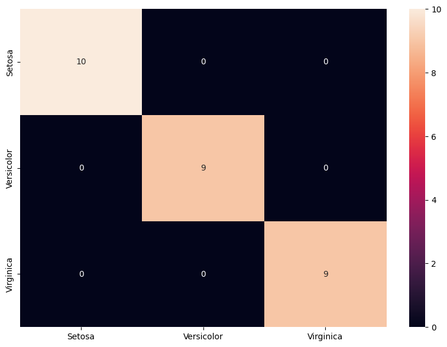
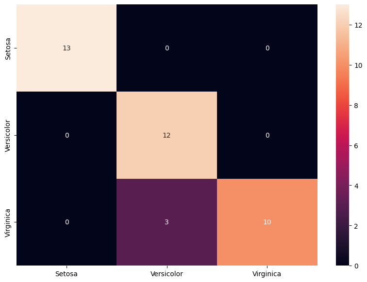
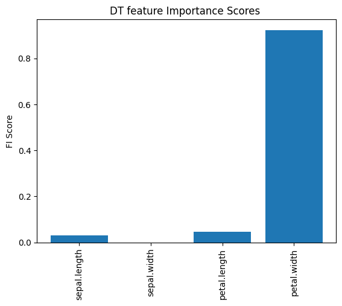

```python
import warnings
warnings.filterwarnings("ignore")
```


```python
import os
import time
import sklearn
import numpy as np
import pandas as pd
from tqdm import tqdm
from random import random
from tabulate import tabulate

import pandas as pd
import seaborn as sns
import matplotlib.pyplot as plt
%matplotlib inline
from sklearn.tree import DecisionTreeClassifier
evaluate={'Acc':"Accuracy", 'b_Acc':"Balanced Accuracy", 'F1':"F1 Score", 'kap':"Kappa", 'ROC':"Roc"}
```


```python
from sklearn.svm import SVC
from xgboost import XGBClassifier
from sklearn.naive_bayes import BernoulliNB
from sklearn.neighbors import KNeighborsClassifier
from sklearn.linear_model import LogisticRegression
from sklearn.tree import DecisionTreeClassifier
from sklearn.metrics import accuracy_score

```


```python
def folder(f_name): #this function creates a folder named "attacks" in the program directory.
    try:
        if not os.path.exists(f_name):
            os.makedirs(f_name)
    except OSError:
        print ("The folder could not be created!")
```


```python
def find_the_way(path,file_format,con=""):
    files_add = []
    # r=root, d=directories, f = files
    for r, d, f in os.walk(path):
        for file in f:
            if file_format in file:
                if con in file:
                    files_add.append(os.path.join(r, file))  
            
    return files_add
path="./csvs"
csv_list=find_the_way(path,".csv")
csv_list
```


    ['./csvs\\iris.csv']


# SPLIT DATA as TRAIN AND TEST


```python
for name in csv_list:   
    print(name)
    df=pd.read_csv(name)#,header=None) 
    X =df[df.columns[0:-1]]
    df[df.columns[-1]] = df[df.columns[-1]].astype('category')
    y=df[df.columns[-1]]

    # setting up testing and training sets
    X_train, X_test, y_train, y_test = sklearn.model_selection.train_test_split(X, y, test_size=0.25, random_state=27,stratify=y)

    # concatenate our training data back together
    train = pd.concat([X_train, y_train], axis=1)


    file=f"{name[0:-4]}_train.csv"
    

    train.to_csv(file,index=False)


    test= pd.concat([X_test, y_test], axis=1)

    file=name[0:-4]+"_"+"test.csv"
    test.to_csv(file.replace("train","test"),index=False)
```

    ./csvs\iris.csv
    


```python
ml_list={"DT":DecisionTreeClassifier()}#,"SVC":SVC()}}
```


```python
def target_name(name):
    df = pd.read_csv(name)
    target_names=sorted(list(df[df.columns[-1]].unique()))
    return target_names
```


```python
folder("results")
```

## Calculation of evaluations


```python
def score(train_time,test_time,predict,y_test,class_based_results,repeat,cv,dname,ml,sw):
    train_time=train_time[0]
    test_time=test_time[0]
    rc=sklearn.metrics.recall_score(y_test, predict,average= "macro")
    pr=sklearn.metrics.precision_score(y_test, predict,average= "macro")
    f_1=sklearn.metrics.f1_score(y_test, predict,average= "macro")     
    accuracy=sklearn.metrics.accuracy_score(y_test, predict)
    accuracy_b=sklearn.metrics.balanced_accuracy_score( y_test,predict)
    kappa=sklearn.metrics.cohen_kappa_score(y_test, predict,labels=None, weights=None, sample_weight=None)
    try:
        roc=sklearn.metrics.roc_auc_score(y_test, predict)
    except:roc=np.nan
    report = sklearn.metrics.classification_report(y_test, predict, target_names=target_names,output_dict=True)
    cr = pd.DataFrame(report).transpose()
    line=[dname,sw,repeat,cv,ml,accuracy,accuracy_b,pr,rc,f_1,kappa,roc,train_time,test_time]

    if class_based_results.empty:
        class_based_results =cr
    else:
        class_based_results = class_based_results.add(cr, fill_value=0)
    return class_based_results,line
```


```python
def ML_CV(loop1,output_csv,cols,dname):
    fold=5
    repetition=10
    sw=np.nan
    for ii in ml_list:
        class_based_results=pd.DataFrame()#"" #pd.DataFrame(0, index=np.arange((len(target_names)+3)), columns=["f1-score","precision","recall","support"])
        cm=pd.DataFrame()
        cv=0
        lines=[["Dataset","SW","T","CV","ML","Acc","b_Acc","Prec","Rec","F1","kap","ROC","tra-T","test-T"]]
        cm = pd.DataFrame()
        for i in range(repetition):

            rnd = random()
            
            kfold = sklearn.model_selection.KFold(n_splits=fold, shuffle=True, random_state=int(rnd*100))  
            cv=0
            df = pd.read_csv(loop1,usecols=cols)#,index_col=0)#,header=None )
            #df = df.reset_index(drop=True)
            df=df.fillna(0)

            #del df["MAC"] # if dataset has MAC colomn please uncomment this line
            X =df[df.columns[0:-1]]
            X=np.array(X)
            df[df.columns[-1]] = df[df.columns[-1]].astype('category')
            y=df[df.columns[-1]].cat.codes  
            X.shape
            for train_index, test_index in kfold.split(X):


                X_train, X_test = X[train_index], X[test_index]
                y_train, y_test = y[train_index], y[test_index]  

      


                #dname=loop1  [6:-13]  
                results_y=[]
                cv+=1
                results_y.append(y_test)


                precision=[]
                recall=[]
                f1=[]
                accuracy=[]
                train_time=[]
                test_time=[]
                total_time=[]
                kappa=[]
                accuracy_b=[]

                    #machine learning algorithm is applied in this section
                clf = ml_list[ii]#choose algorithm from ml_list dictionary
                second=time.time()
                clf.fit(X_train, y_train)
                train_time.append(float((time.time()-second)) )
                second=time.time()
                predict =clf.predict(X_test)
                test_time.append(float((time.time()-second)) )
    
                altime=0
                class_based_results,line=score(train_time,test_time,predict,y_test,class_based_results,cv,i,dname,ii,sw)
                lines.append(line)

                
                
                
                
                df_cm = pd.DataFrame(sklearn.metrics.confusion_matrix(y_test, predict))
                if cm.empty:
                    cm =df_cm
                else:
                    cm = cm.add(df_cm, fill_value=0)
                
                
                
                
                
        results = pd.DataFrame (lines[1:], columns = lines[0])
        results.to_csv(output_csv.replace("ML",ii),index=False)
        results=results.round(3)
        del results["SW"]
        del results["ROC"]
        print (tabulate(results, headers=list(results.columns),tablefmt="double_grid"))
        #print()
        if True:
            cm=cm//(repetition*cv)
            graph_name=output_csv[:-4]+"_confusion matrix.pdf"   
            plt.figure(figsize = (10,7))
            sns.heatmap(cm,xticklabels=target_names, yticklabels=target_names, annot=True, fmt='g')
            plt.savefig(graph_name,bbox_inches='tight')#, dpi=400)
            plt.show()
            #print(cm)
            print("\n\n\n")             


```

# 10 fold 10 times Cross-Validating


```python
feature=["sepal.length","sepal.width","petal.length","petal.width","variety"]
```


```python
train="./csvs/iris.csv"
output_csv="./results/CV.csv"
target_names=target_name(train)
dname="IRIS_10X10_CV"
```


```python
ML_CV(train,output_csv,feature,dname)   
```

    ╔════╦═══════════════╦═════╦══════╦══════╦═══════╦═════════╦════════╦═══════╦═══════╦═══════╦═════════╦══════════╗
    ║    ║ Dataset       ║   T ║   CV ║ ML   ║   Acc ║   b_Acc ║   Prec ║   Rec ║    F1 ║   kap ║   tra-T ║   test-T ║
    ╠════╬═══════════════╬═════╬══════╬══════╬═══════╬═════════╬════════╬═══════╬═══════╬═══════╬═════════╬══════════╣
    ║  0 ║ IRIS_10X10_CV ║   1 ║    0 ║ DT   ║ 0.933 ║   0.939 ║  0.944 ║ 0.939 ║ 0.936 ║ 0.9   ║   0.001 ║    0     ║
    ╠════╬═══════════════╬═════╬══════╬══════╬═══════╬═════════╬════════╬═══════╬═══════╬═══════╬═════════╬══════════╣
    ║  1 ║ IRIS_10X10_CV ║   2 ║    0 ║ DT   ║ 0.967 ║   0.963 ║  0.963 ║ 0.963 ║ 0.961 ║ 0.949 ║   0.001 ║    0     ║
    ╠════╬═══════════════╬═════╬══════╬══════╬═══════╬═════════╬════════╬═══════╬═══════╬═══════╬═════════╬══════════╣
    ║  2 ║ IRIS_10X10_CV ║   3 ║    0 ║ DT   ║ 0.967 ║   0.972 ║  0.974 ║ 0.972 ║ 0.972 ║ 0.948 ║   0     ║    0     ║
    ╠════╬═══════════════╬═════╬══════╬══════╬═══════╬═════════╬════════╬═══════╬═══════╬═══════╬═════════╬══════════╣
    ║  3 ║ IRIS_10X10_CV ║   4 ║    0 ║ DT   ║ 0.933 ║   0.933 ║  0.926 ║ 0.933 ║ 0.921 ║ 0.898 ║   0     ║    0     ║
    ╠════╬═══════════════╬═════╬══════╬══════╬═══════╬═════════╬════════╬═══════╬═══════╬═══════╬═════════╬══════════╣
    ║  4 ║ IRIS_10X10_CV ║   5 ║    0 ║ DT   ║ 0.867 ║   0.876 ║  0.88  ║ 0.876 ║ 0.873 ║ 0.8   ║   0     ║    0     ║
    ╠════╬═══════════════╬═════╬══════╬══════╬═══════╬═════════╬════════╬═══════╬═══════╬═══════╬═════════╬══════════╣
    ║  5 ║ IRIS_10X10_CV ║   1 ║    1 ║ DT   ║ 0.967 ║   0.972 ║  0.958 ║ 0.972 ║ 0.963 ║ 0.949 ║   0     ║    0     ║
    ╠════╬═══════════════╬═════╬══════╬══════╬═══════╬═════════╬════════╬═══════╬═══════╬═══════╬═════════╬══════════╣
    ║  6 ║ IRIS_10X10_CV ║   2 ║    1 ║ DT   ║ 0.967 ║   0.972 ║  0.944 ║ 0.972 ║ 0.955 ║ 0.947 ║   0     ║    0     ║
    ╠════╬═══════════════╬═════╬══════╬══════╬═══════╬═════════╬════════╬═══════╬═══════╬═══════╬═════════╬══════════╣
    ║  7 ║ IRIS_10X10_CV ║   3 ║    1 ║ DT   ║ 0.9   ║   0.907 ║  0.898 ║ 0.907 ║ 0.901 ║ 0.848 ║   0     ║    0     ║
    ╠════╬═══════════════╬═════╬══════╬══════╬═══════╬═════════╬════════╬═══════╬═══════╬═══════╬═════════╬══════════╣
    ║  8 ║ IRIS_10X10_CV ║   4 ║    1 ║ DT   ║ 0.933 ║   0.956 ║  0.889 ║ 0.956 ║ 0.91  ║ 0.893 ║   0     ║    0     ║
    ╠════╬═══════════════╬═════╬══════╬══════╬═══════╬═════════╬════════╬═══════╬═══════╬═══════╬═════════╬══════════╣
    ║  9 ║ IRIS_10X10_CV ║   5 ║    1 ║ DT   ║ 1     ║   1     ║  1     ║ 1     ║ 1     ║ 1     ║   0     ║    0     ║
    ╠════╬═══════════════╬═════╬══════╬══════╬═══════╬═════════╬════════╬═══════╬═══════╬═══════╬═════════╬══════════╣
    ║ 10 ║ IRIS_10X10_CV ║   1 ║    2 ║ DT   ║ 0.933 ║   0.939 ║  0.939 ║ 0.939 ║ 0.939 ║ 0.899 ║   0     ║    0     ║
    ╠════╬═══════════════╬═════╬══════╬══════╬═══════╬═════════╬════════╬═══════╬═══════╬═══════╬═════════╬══════════╣
    ║ 11 ║ IRIS_10X10_CV ║   2 ║    2 ║ DT   ║ 0.933 ║   0.952 ║  0.926 ║ 0.952 ║ 0.933 ║ 0.898 ║   0     ║    0     ║
    ╠════╬═══════════════╬═════╬══════╬══════╬═══════╬═════════╬════════╬═══════╬═══════╬═══════╬═════════╬══════════╣
    ║ 12 ║ IRIS_10X10_CV ║   3 ║    2 ║ DT   ║ 0.967 ║   0.972 ║  0.944 ║ 0.972 ║ 0.955 ║ 0.947 ║   0     ║    0     ║
    ╠════╬═══════════════╬═════╬══════╬══════╬═══════╬═════════╬════════╬═══════╬═══════╬═══════╬═════════╬══════════╣
    ║ 13 ║ IRIS_10X10_CV ║   4 ║    2 ║ DT   ║ 1     ║   1     ║  1     ║ 1     ║ 1     ║ 1     ║   0     ║    0     ║
    ╠════╬═══════════════╬═════╬══════╬══════╬═══════╬═════════╬════════╬═══════╬═══════╬═══════╬═════════╬══════════╣
    ║ 14 ║ IRIS_10X10_CV ║   5 ║    2 ║ DT   ║ 0.9   ║   0.911 ║  0.909 ║ 0.911 ║ 0.909 ║ 0.848 ║   0.007 ║    0     ║
    ╠════╬═══════════════╬═════╬══════╬══════╬═══════╬═════════╬════════╬═══════╬═══════╬═══════╬═════════╬══════════╣
    ║ 15 ║ IRIS_10X10_CV ║   1 ║    3 ║ DT   ║ 0.933 ║   0.939 ║  0.944 ║ 0.939 ║ 0.936 ║ 0.9   ║   0     ║    0     ║
    ╠════╬═══════════════╬═════╬══════╬══════╬═══════╬═════════╬════════╬═══════╬═══════╬═══════╬═════════╬══════════╣
    ║ 16 ║ IRIS_10X10_CV ║   2 ║    3 ║ DT   ║ 0.967 ║   0.963 ║  0.963 ║ 0.963 ║ 0.961 ║ 0.949 ║   0     ║    0     ║
    ╠════╬═══════════════╬═════╬══════╬══════╬═══════╬═════════╬════════╬═══════╬═══════╬═══════╬═════════╬══════════╣
    ║ 17 ║ IRIS_10X10_CV ║   3 ║    3 ║ DT   ║ 0.933 ║   0.944 ║  0.944 ║ 0.944 ║ 0.944 ║ 0.896 ║   0     ║    0     ║
    ╠════╬═══════════════╬═════╬══════╬══════╬═══════╬═════════╬════════╬═══════╬═══════╬═══════╬═════════╬══════════╣
    ║ 18 ║ IRIS_10X10_CV ║   4 ║    3 ║ DT   ║ 0.933 ║   0.933 ║  0.926 ║ 0.933 ║ 0.921 ║ 0.898 ║   0     ║    0     ║
    ╠════╬═══════════════╬═════╬══════╬══════╬═══════╬═════════╬════════╬═══════╬═══════╬═══════╬═════════╬══════════╣
    ║ 19 ║ IRIS_10X10_CV ║   5 ║    3 ║ DT   ║ 0.867 ║   0.876 ║  0.88  ║ 0.876 ║ 0.873 ║ 0.8   ║   0     ║    0     ║
    ╠════╬═══════════════╬═════╬══════╬══════╬═══════╬═════════╬════════╬═══════╬═══════╬═══════╬═════════╬══════════╣
    ║ 20 ║ IRIS_10X10_CV ║   1 ║    4 ║ DT   ║ 1     ║   1     ║  1     ║ 1     ║ 1     ║ 1     ║   0     ║    0     ║
    ╠════╬═══════════════╬═════╬══════╬══════╬═══════╬═════════╬════════╬═══════╬═══════╬═══════╬═════════╬══════════╣
    ║ 21 ║ IRIS_10X10_CV ║   2 ║    4 ║ DT   ║ 0.967 ║   0.958 ║  0.972 ║ 0.958 ║ 0.963 ║ 0.949 ║   0     ║    0     ║
    ╠════╬═══════════════╬═════╬══════╬══════╬═══════╬═════════╬════════╬═══════╬═══════╬═══════╬═════════╬══════════╣
    ║ 22 ║ IRIS_10X10_CV ║   3 ║    4 ║ DT   ║ 0.933 ║   0.905 ║  0.952 ║ 0.905 ║ 0.919 ║ 0.896 ║   0     ║    0     ║
    ╠════╬═══════════════╬═════╬══════╬══════╬═══════╬═════════╬════════╬═══════╬═══════╬═══════╬═════════╬══════════╣
    ║ 23 ║ IRIS_10X10_CV ║   4 ║    4 ║ DT   ║ 0.933 ║   0.933 ║  0.933 ║ 0.933 ║ 0.933 ║ 0.9   ║   0.003 ║    0     ║
    ╠════╬═══════════════╬═════╬══════╬══════╬═══════╬═════════╬════════╬═══════╬═══════╬═══════╬═════════╬══════════╣
    ║ 24 ║ IRIS_10X10_CV ║   5 ║    4 ║ DT   ║ 0.867 ║   0.876 ║  0.88  ║ 0.876 ║ 0.873 ║ 0.8   ║   0     ║    0     ║
    ╠════╬═══════════════╬═════╬══════╬══════╬═══════╬═════════╬════════╬═══════╬═══════╬═══════╬═════════╬══════════╣
    ║ 25 ║ IRIS_10X10_CV ║   1 ║    5 ║ DT   ║ 0.967 ║   0.967 ║  0.97  ║ 0.967 ║ 0.967 ║ 0.95  ║   0     ║    0     ║
    ╠════╬═══════════════╬═════╬══════╬══════╬═══════╬═════════╬════════╬═══════╬═══════╬═══════╬═════════╬══════════╣
    ║ 26 ║ IRIS_10X10_CV ║   2 ║    5 ║ DT   ║ 0.967 ║   0.98  ║  0.958 ║ 0.98  ║ 0.968 ║ 0.944 ║   0     ║    0     ║
    ╠════╬═══════════════╬═════╬══════╬══════╬═══════╬═════════╬════════╬═══════╬═══════╬═══════╬═════════╬══════════╣
    ║ 27 ║ IRIS_10X10_CV ║   3 ║    5 ║ DT   ║ 0.933 ║   0.924 ║  0.924 ║ 0.924 ║ 0.924 ║ 0.89  ║   0     ║    0     ║
    ╠════╬═══════════════╬═════╬══════╬══════╬═══════╬═════════╬════════╬═══════╬═══════╬═══════╬═════════╬══════════╣
    ║ 28 ║ IRIS_10X10_CV ║   4 ║    5 ║ DT   ║ 1     ║   1     ║  1     ║ 1     ║ 1     ║ 1     ║   0     ║    0     ║
    ╠════╬═══════════════╬═════╬══════╬══════╬═══════╬═════════╬════════╬═══════╬═══════╬═══════╬═════════╬══════════╣
    ║ 29 ║ IRIS_10X10_CV ║   5 ║    5 ║ DT   ║ 0.967 ║   0.958 ║  0.97  ║ 0.958 ║ 0.962 ║ 0.949 ║   0     ║    0     ║
    ╠════╬═══════════════╬═════╬══════╬══════╬═══════╬═════════╬════════╬═══════╬═══════╬═══════╬═════════╬══════════╣
    ║ 30 ║ IRIS_10X10_CV ║   1 ║    6 ║ DT   ║ 0.967 ║   0.967 ║  0.97  ║ 0.967 ║ 0.967 ║ 0.95  ║   0     ║    0     ║
    ╠════╬═══════════════╬═════╬══════╬══════╬═══════╬═════════╬════════╬═══════╬═══════╬═══════╬═════════╬══════════╣
    ║ 31 ║ IRIS_10X10_CV ║   2 ║    6 ║ DT   ║ 0.967 ║   0.98  ║  0.958 ║ 0.98  ║ 0.968 ║ 0.944 ║   0     ║    0     ║
    ╠════╬═══════════════╬═════╬══════╬══════╬═══════╬═════════╬════════╬═══════╬═══════╬═══════╬═════════╬══════════╣
    ║ 32 ║ IRIS_10X10_CV ║   3 ║    6 ║ DT   ║ 0.933 ║   0.924 ║  0.924 ║ 0.924 ║ 0.924 ║ 0.89  ║   0     ║    0     ║
    ╠════╬═══════════════╬═════╬══════╬══════╬═══════╬═════════╬════════╬═══════╬═══════╬═══════╬═════════╬══════════╣
    ║ 33 ║ IRIS_10X10_CV ║   4 ║    6 ║ DT   ║ 1     ║   1     ║  1     ║ 1     ║ 1     ║ 1     ║   0.001 ║    0     ║
    ╠════╬═══════════════╬═════╬══════╬══════╬═══════╬═════════╬════════╬═══════╬═══════╬═══════╬═════════╬══════════╣
    ║ 34 ║ IRIS_10X10_CV ║   5 ║    6 ║ DT   ║ 0.933 ║   0.917 ║  0.944 ║ 0.917 ║ 0.922 ║ 0.898 ║   0     ║    0.001 ║
    ╠════╬═══════════════╬═════╬══════╬══════╬═══════╬═════════╬════════╬═══════╬═══════╬═══════╬═════════╬══════════╣
    ║ 35 ║ IRIS_10X10_CV ║   1 ║    7 ║ DT   ║ 0.933 ║   0.928 ║  0.928 ║ 0.928 ║ 0.928 ║ 0.899 ║   0     ║    0     ║
    ╠════╬═══════════════╬═════╬══════╬══════╬═══════╬═════════╬════════╬═══════╬═══════╬═══════╬═════════╬══════════╣
    ║ 36 ║ IRIS_10X10_CV ║   2 ║    7 ║ DT   ║ 0.967 ║   0.974 ║  0.963 ║ 0.974 ║ 0.967 ║ 0.949 ║   0.001 ║    0     ║
    ╠════╬═══════════════╬═════╬══════╬══════╬═══════╬═════════╬════════╬═══════╬═══════╬═══════╬═════════╬══════════╣
    ║ 37 ║ IRIS_10X10_CV ║   3 ║    7 ║ DT   ║ 0.9   ║   0.906 ║  0.906 ║ 0.906 ║ 0.905 ║ 0.85  ║   0     ║    0     ║
    ╠════╬═══════════════╬═════╬══════╬══════╬═══════╬═════════╬════════╬═══════╬═══════╬═══════╬═════════╬══════════╣
    ║ 38 ║ IRIS_10X10_CV ║   4 ║    7 ║ DT   ║ 0.967 ║   0.967 ║  0.967 ║ 0.967 ║ 0.965 ║ 0.95  ║   0.001 ║    0     ║
    ╠════╬═══════════════╬═════╬══════╬══════╬═══════╬═════════╬════════╬═══════╬═══════╬═══════╬═════════╬══════════╣
    ║ 39 ║ IRIS_10X10_CV ║   5 ║    7 ║ DT   ║ 0.967 ║   0.97  ║  0.967 ║ 0.97  ║ 0.967 ║ 0.95  ║   0     ║    0.001 ║
    ╠════╬═══════════════╬═════╬══════╬══════╬═══════╬═════════╬════════╬═══════╬═══════╬═══════╬═════════╬══════════╣
    ║ 40 ║ IRIS_10X10_CV ║   1 ║    8 ║ DT   ║ 0.967 ║   0.963 ║  0.958 ║ 0.963 ║ 0.958 ║ 0.948 ║   0.001 ║    0     ║
    ╠════╬═══════════════╬═════╬══════╬══════╬═══════╬═════════╬════════╬═══════╬═══════╬═══════╬═════════╬══════════╣
    ║ 41 ║ IRIS_10X10_CV ║   2 ║    8 ║ DT   ║ 0.9   ║   0.9   ║  0.923 ║ 0.9   ║ 0.898 ║ 0.85  ║   0.001 ║    0     ║
    ╠════╬═══════════════╬═════╬══════╬══════╬═══════╬═════════╬════════╬═══════╬═══════╬═══════╬═════════╬══════════╣
    ║ 42 ║ IRIS_10X10_CV ║   3 ║    8 ║ DT   ║ 0.9   ║   0.883 ║  0.892 ║ 0.883 ║ 0.886 ║ 0.847 ║   0.002 ║    0     ║
    ╠════╬═══════════════╬═════╬══════╬══════╬═══════╬═════════╬════════╬═══════╬═══════╬═══════╬═════════╬══════════╣
    ║ 43 ║ IRIS_10X10_CV ║   4 ║    8 ║ DT   ║ 0.933 ║   0.933 ║  0.933 ║ 0.933 ║ 0.933 ║ 0.9   ║   0     ║    0     ║
    ╠════╬═══════════════╬═════╬══════╬══════╬═══════╬═════════╬════════╬═══════╬═══════╬═══════╬═════════╬══════════╣
    ║ 44 ║ IRIS_10X10_CV ║   5 ║    8 ║ DT   ║ 1     ║   1     ║  1     ║ 1     ║ 1     ║ 1     ║   0     ║    0.001 ║
    ╠════╬═══════════════╬═════╬══════╬══════╬═══════╬═════════╬════════╬═══════╬═══════╬═══════╬═════════╬══════════╣
    ║ 45 ║ IRIS_10X10_CV ║   1 ║    9 ║ DT   ║ 0.967 ║   0.963 ║  0.963 ║ 0.963 ║ 0.961 ║ 0.949 ║   0.001 ║    0     ║
    ╠════╬═══════════════╬═════╬══════╬══════╬═══════╬═════════╬════════╬═══════╬═══════╬═══════╬═════════╬══════════╣
    ║ 46 ║ IRIS_10X10_CV ║   2 ║    9 ║ DT   ║ 0.967 ║   0.967 ║  0.974 ║ 0.967 ║ 0.969 ║ 0.949 ║   0.001 ║    0     ║
    ╠════╬═══════════════╬═════╬══════╬══════╬═══════╬═════════╬════════╬═══════╬═══════╬═══════╬═════════╬══════════╣
    ║ 47 ║ IRIS_10X10_CV ║   3 ║    9 ║ DT   ║ 0.9   ║   0.909 ║  0.923 ║ 0.909 ║ 0.904 ║ 0.85  ║   0.001 ║    0     ║
    ╠════╬═══════════════╬═════╬══════╬══════╬═══════╬═════════╬════════╬═══════╬═══════╬═══════╬═════════╬══════════╣
    ║ 48 ║ IRIS_10X10_CV ║   4 ║    9 ║ DT   ║ 0.967 ║   0.958 ║  0.967 ║ 0.958 ║ 0.96  ║ 0.949 ║   0     ║    0     ║
    ╠════╬═══════════════╬═════╬══════╬══════╬═══════╬═════════╬════════╬═══════╬═══════╬═══════╬═════════╬══════════╣
    ║ 49 ║ IRIS_10X10_CV ║   5 ║    9 ║ DT   ║ 0.933 ║   0.942 ║  0.942 ║ 0.942 ║ 0.942 ║ 0.898 ║   0.001 ║    0     ║
    ╚════╩═══════════════╩═════╩══════╩══════╩═══════╩═════════╩════════╩═══════╩═══════╩═══════╩═════════╩══════════╝
    


    

    


    
    
    
    
    

# seperated train test


```python
def ML(loop1,loop2,output_csv,cols,dname):
    fold=5
    repetition=100
    sw=np.nan
    for ii in ml_list:
        class_based_results=pd.DataFrame()#"" #pd.DataFrame(0, index=np.arange((len(target_names)+3)), columns=["f1-score","precision","recall","support"])
        cm=pd.DataFrame()
        cv=0
        lines=[["Dataset","SW","T","CV","ML","Acc","b_Acc","Prec","Rec","F1","kap","ROC","tra-T","test-T"]]
        cm = pd.DataFrame()
        for i in range(repetition):

            #rnd = random()
            
            #kfold = sklearn.model_selection.KFold(n_splits=fold, shuffle=True, random_state=int(rnd*100))  
            cv=0
            df = pd.read_csv(loop1,usecols=cols)#,header=None )
            df=df.fillna(0)
            X_train =df[df.columns[0:-1]]
            X_train=np.array(X_train)
            df[df.columns[-1]] = df[df.columns[-1]].astype('category')
            y_train=df[df.columns[-1]].cat.codes  


            df = pd.read_csv(loop2,usecols=cols)#,header=None )
            df=df.fillna(0)
            X_test =df[df.columns[0:-1]]
            X_test=np.array(X_test)
            df[df.columns[-1]] = df[df.columns[-1]].astype('category')
            y_test=df[df.columns[-1]].cat.codes  


      


            #dname=loop1  [6:-13]  
            results_y=[]
            cv+=1
            results_y.append(y_test)


            precision=[]
            recall=[]
            f1=[]
            accuracy=[]
            train_time=[]
            test_time=[]
            total_time=[]
            kappa=[]
            accuracy_b=[]

                #machine learning algorithm is applied in this section
            clf = ml_list[ii]#choose algorithm from ml_list dictionary
            second=time.time()
            clf.fit(X_train, y_train)
            train_time.append(float((time.time()-second)) )
            second=time.time()
            predict =clf.predict(X_test)
            test_time.append(float((time.time()-second)) )

            altime=0
            class_based_results,line=score(train_time,test_time,predict,y_test,class_based_results,cv,i,dname,ii,sw)
            lines.append(line)


            df_cm = pd.DataFrame(sklearn.metrics.confusion_matrix(y_test, predict))
            if cm.empty:
                cm =df_cm
            else:
                cm = cm.add(df_cm, fill_value=0)


                
                
        results = pd.DataFrame (lines[1:], columns = lines[0])
        results.to_csv(output_csv.replace("ML",ii),index=False)
        results=results.round(3)
        del results["SW"]
        del results["ROC"]
        print (tabulate(results, headers=list(results.columns),tablefmt="double_grid"))
       
        
        #print()
        if True:
            cm=cm//(repetition*cv)
            graph_name=output_csv+ii+"_confusion matrix.pdf"   
            plt.figure(figsize = (10,7))
            sns.heatmap(cm,xticklabels=target_names, yticklabels=target_names, annot=True, fmt='g')
            plt.savefig(graph_name,bbox_inches='tight')#, dpi=400)
            plt.show()
            #print(cm)
            print("\n\n\n")             


```


```python
train="./csvs/iris_train.csv"
test="./csvs/iris_test.csv"
output_csv="./results/100R.csv"
target_names=target_name(train)
dname="IRIS_100_times"

```


```python
ML(train,test,output_csv,feature,dname)   
```

    ╔════╦════════════════╦═════╦══════╦══════╦═══════╦═════════╦════════╦═══════╦═══════╦═══════╦═════════╦══════════╗
    ║    ║ Dataset        ║   T ║   CV ║ ML   ║   Acc ║   b_Acc ║   Prec ║   Rec ║    F1 ║   kap ║   tra-T ║   test-T ║
    ╠════╬════════════════╬═════╬══════╬══════╬═══════╬═════════╬════════╬═══════╬═══════╬═══════╬═════════╬══════════╣
    ║  0 ║ IRIS_100_times ║   1 ║    0 ║ DT   ║ 0.921 ║   0.923 ║  0.933 ║ 0.923 ║ 0.919 ║ 0.882 ║   0.001 ║    0     ║
    ╠════╬════════════════╬═════╬══════╬══════╬═══════╬═════════╬════════╬═══════╬═══════╬═══════╬═════════╬══════════╣
    ║  1 ║ IRIS_100_times ║   1 ║    1 ║ DT   ║ 0.921 ║   0.923 ║  0.933 ║ 0.923 ║ 0.919 ║ 0.882 ║   0.001 ║    0     ║
    ╠════╬════════════════╬═════╬══════╬══════╬═══════╬═════════╬════════╬═══════╬═══════╬═══════╬═════════╬══════════╣
    ║  2 ║ IRIS_100_times ║   1 ║    2 ║ DT   ║ 0.921 ║   0.923 ║  0.933 ║ 0.923 ║ 0.919 ║ 0.882 ║   0     ║    0     ║
    ╠════╬════════════════╬═════╬══════╬══════╬═══════╬═════════╬════════╬═══════╬═══════╬═══════╬═════════╬══════════╣
    ║  3 ║ IRIS_100_times ║   1 ║    3 ║ DT   ║ 0.921 ║   0.923 ║  0.933 ║ 0.923 ║ 0.919 ║ 0.882 ║   0     ║    0     ║
    ╠════╬════════════════╬═════╬══════╬══════╬═══════╬═════════╬════════╬═══════╬═══════╬═══════╬═════════╬══════════╣
    ║  4 ║ IRIS_100_times ║   1 ║    4 ║ DT   ║ 0.921 ║   0.923 ║  0.933 ║ 0.923 ║ 0.919 ║ 0.882 ║   0     ║    0     ║
    ╠════╬════════════════╬═════╬══════╬══════╬═══════╬═════════╬════════╬═══════╬═══════╬═══════╬═════════╬══════════╣
    ║  5 ║ IRIS_100_times ║   1 ║    5 ║ DT   ║ 0.921 ║   0.923 ║  0.933 ║ 0.923 ║ 0.919 ║ 0.882 ║   0     ║    0     ║
    ╠════╬════════════════╬═════╬══════╬══════╬═══════╬═════════╬════════╬═══════╬═══════╬═══════╬═════════╬══════════╣
    ║  6 ║ IRIS_100_times ║   1 ║    6 ║ DT   ║ 0.921 ║   0.923 ║  0.933 ║ 0.923 ║ 0.919 ║ 0.882 ║   0     ║    0     ║
    ╠════╬════════════════╬═════╬══════╬══════╬═══════╬═════════╬════════╬═══════╬═══════╬═══════╬═════════╬══════════╣
    ║  7 ║ IRIS_100_times ║   1 ║    7 ║ DT   ║ 0.921 ║   0.923 ║  0.933 ║ 0.923 ║ 0.919 ║ 0.882 ║   0     ║    0     ║
    ╠════╬════════════════╬═════╬══════╬══════╬═══════╬═════════╬════════╬═══════╬═══════╬═══════╬═════════╬══════════╣
    ║  8 ║ IRIS_100_times ║   1 ║    8 ║ DT   ║ 0.921 ║   0.923 ║  0.933 ║ 0.923 ║ 0.919 ║ 0.882 ║   0     ║    0     ║
    ╠════╬════════════════╬═════╬══════╬══════╬═══════╬═════════╬════════╬═══════╬═══════╬═══════╬═════════╬══════════╣
    ║  9 ║ IRIS_100_times ║   1 ║    9 ║ DT   ║ 0.921 ║   0.923 ║  0.933 ║ 0.923 ║ 0.919 ║ 0.882 ║   0     ║    0     ║
    ╠════╬════════════════╬═════╬══════╬══════╬═══════╬═════════╬════════╬═══════╬═══════╬═══════╬═════════╬══════════╣
    ║ 10 ║ IRIS_100_times ║   1 ║   10 ║ DT   ║ 0.921 ║   0.923 ║  0.933 ║ 0.923 ║ 0.919 ║ 0.882 ║   0     ║    0     ║
    ╠════╬════════════════╬═════╬══════╬══════╬═══════╬═════════╬════════╬═══════╬═══════╬═══════╬═════════╬══════════╣
    ║ 11 ║ IRIS_100_times ║   1 ║   11 ║ DT   ║ 0.921 ║   0.923 ║  0.933 ║ 0.923 ║ 0.919 ║ 0.882 ║   0     ║    0     ║
    ╠════╬════════════════╬═════╬══════╬══════╬═══════╬═════════╬════════╬═══════╬═══════╬═══════╬═════════╬══════════╣
    ║ 12 ║ IRIS_100_times ║   1 ║   12 ║ DT   ║ 0.921 ║   0.923 ║  0.933 ║ 0.923 ║ 0.919 ║ 0.882 ║   0     ║    0     ║
    ╠════╬════════════════╬═════╬══════╬══════╬═══════╬═════════╬════════╬═══════╬═══════╬═══════╬═════════╬══════════╣
    ║ 13 ║ IRIS_100_times ║   1 ║   13 ║ DT   ║ 0.921 ║   0.923 ║  0.933 ║ 0.923 ║ 0.919 ║ 0.882 ║   0     ║    0     ║
    ╠════╬════════════════╬═════╬══════╬══════╬═══════╬═════════╬════════╬═══════╬═══════╬═══════╬═════════╬══════════╣
    ║ 14 ║ IRIS_100_times ║   1 ║   14 ║ DT   ║ 0.921 ║   0.923 ║  0.933 ║ 0.923 ║ 0.919 ║ 0.882 ║   0     ║    0     ║
    ╠════╬════════════════╬═════╬══════╬══════╬═══════╬═════════╬════════╬═══════╬═══════╬═══════╬═════════╬══════════╣
    ║ 15 ║ IRIS_100_times ║   1 ║   15 ║ DT   ║ 0.921 ║   0.923 ║  0.933 ║ 0.923 ║ 0.919 ║ 0.882 ║   0     ║    0     ║
    ╠════╬════════════════╬═════╬══════╬══════╬═══════╬═════════╬════════╬═══════╬═══════╬═══════╬═════════╬══════════╣
    ║ 16 ║ IRIS_100_times ║   1 ║   16 ║ DT   ║ 0.921 ║   0.923 ║  0.933 ║ 0.923 ║ 0.919 ║ 0.882 ║   0     ║    0     ║
    ╠════╬════════════════╬═════╬══════╬══════╬═══════╬═════════╬════════╬═══════╬═══════╬═══════╬═════════╬══════════╣
    ║ 17 ║ IRIS_100_times ║   1 ║   17 ║ DT   ║ 0.921 ║   0.923 ║  0.933 ║ 0.923 ║ 0.919 ║ 0.882 ║   0     ║    0     ║
    ╠════╬════════════════╬═════╬══════╬══════╬═══════╬═════════╬════════╬═══════╬═══════╬═══════╬═════════╬══════════╣
    ║ 18 ║ IRIS_100_times ║   1 ║   18 ║ DT   ║ 0.921 ║   0.923 ║  0.933 ║ 0.923 ║ 0.919 ║ 0.882 ║   0     ║    0     ║
    ╠════╬════════════════╬═════╬══════╬══════╬═══════╬═════════╬════════╬═══════╬═══════╬═══════╬═════════╬══════════╣
    ║ 19 ║ IRIS_100_times ║   1 ║   19 ║ DT   ║ 0.921 ║   0.923 ║  0.933 ║ 0.923 ║ 0.919 ║ 0.882 ║   0     ║    0     ║
    ╠════╬════════════════╬═════╬══════╬══════╬═══════╬═════════╬════════╬═══════╬═══════╬═══════╬═════════╬══════════╣
    ║ 20 ║ IRIS_100_times ║   1 ║   20 ║ DT   ║ 0.921 ║   0.923 ║  0.933 ║ 0.923 ║ 0.919 ║ 0.882 ║   0     ║    0     ║
    ╠════╬════════════════╬═════╬══════╬══════╬═══════╬═════════╬════════╬═══════╬═══════╬═══════╬═════════╬══════════╣
    ║ 21 ║ IRIS_100_times ║   1 ║   21 ║ DT   ║ 0.921 ║   0.923 ║  0.933 ║ 0.923 ║ 0.919 ║ 0.882 ║   0     ║    0     ║
    ╠════╬════════════════╬═════╬══════╬══════╬═══════╬═════════╬════════╬═══════╬═══════╬═══════╬═════════╬══════════╣
    ║ 22 ║ IRIS_100_times ║   1 ║   22 ║ DT   ║ 0.921 ║   0.923 ║  0.933 ║ 0.923 ║ 0.919 ║ 0.882 ║   0     ║    0     ║
    ╠════╬════════════════╬═════╬══════╬══════╬═══════╬═════════╬════════╬═══════╬═══════╬═══════╬═════════╬══════════╣
    ║ 23 ║ IRIS_100_times ║   1 ║   23 ║ DT   ║ 0.921 ║   0.923 ║  0.933 ║ 0.923 ║ 0.919 ║ 0.882 ║   0     ║    0     ║
    ╠════╬════════════════╬═════╬══════╬══════╬═══════╬═════════╬════════╬═══════╬═══════╬═══════╬═════════╬══════════╣
    ║ 24 ║ IRIS_100_times ║   1 ║   24 ║ DT   ║ 0.921 ║   0.923 ║  0.933 ║ 0.923 ║ 0.919 ║ 0.882 ║   0.013 ║    0     ║
    ╠════╬════════════════╬═════╬══════╬══════╬═══════╬═════════╬════════╬═══════╬═══════╬═══════╬═════════╬══════════╣
    ║ 25 ║ IRIS_100_times ║   1 ║   25 ║ DT   ║ 0.921 ║   0.923 ║  0.933 ║ 0.923 ║ 0.919 ║ 0.882 ║   0     ║    0     ║
    ╠════╬════════════════╬═════╬══════╬══════╬═══════╬═════════╬════════╬═══════╬═══════╬═══════╬═════════╬══════════╣
    ║ 26 ║ IRIS_100_times ║   1 ║   26 ║ DT   ║ 0.921 ║   0.923 ║  0.933 ║ 0.923 ║ 0.919 ║ 0.882 ║   0     ║    0     ║
    ╠════╬════════════════╬═════╬══════╬══════╬═══════╬═════════╬════════╬═══════╬═══════╬═══════╬═════════╬══════════╣
    ║ 27 ║ IRIS_100_times ║   1 ║   27 ║ DT   ║ 0.921 ║   0.923 ║  0.933 ║ 0.923 ║ 0.919 ║ 0.882 ║   0     ║    0.016 ║
    ╠════╬════════════════╬═════╬══════╬══════╬═══════╬═════════╬════════╬═══════╬═══════╬═══════╬═════════╬══════════╣
    ║ 28 ║ IRIS_100_times ║   1 ║   28 ║ DT   ║ 0.921 ║   0.923 ║  0.933 ║ 0.923 ║ 0.919 ║ 0.882 ║   0.016 ║    0     ║
    ╠════╬════════════════╬═════╬══════╬══════╬═══════╬═════════╬════════╬═══════╬═══════╬═══════╬═════════╬══════════╣
    ║ 29 ║ IRIS_100_times ║   1 ║   29 ║ DT   ║ 0.921 ║   0.923 ║  0.933 ║ 0.923 ║ 0.919 ║ 0.882 ║   0     ║    0     ║
    ╠════╬════════════════╬═════╬══════╬══════╬═══════╬═════════╬════════╬═══════╬═══════╬═══════╬═════════╬══════════╣
    ║ 30 ║ IRIS_100_times ║   1 ║   30 ║ DT   ║ 0.921 ║   0.923 ║  0.933 ║ 0.923 ║ 0.919 ║ 0.882 ║   0.003 ║    0     ║
    ╠════╬════════════════╬═════╬══════╬══════╬═══════╬═════════╬════════╬═══════╬═══════╬═══════╬═════════╬══════════╣
    ║ 31 ║ IRIS_100_times ║   1 ║   31 ║ DT   ║ 0.921 ║   0.923 ║  0.933 ║ 0.923 ║ 0.919 ║ 0.882 ║   0     ║    0     ║
    ╠════╬════════════════╬═════╬══════╬══════╬═══════╬═════════╬════════╬═══════╬═══════╬═══════╬═════════╬══════════╣
    ║ 32 ║ IRIS_100_times ║   1 ║   32 ║ DT   ║ 0.921 ║   0.923 ║  0.933 ║ 0.923 ║ 0.919 ║ 0.882 ║   0     ║    0     ║
    ╠════╬════════════════╬═════╬══════╬══════╬═══════╬═════════╬════════╬═══════╬═══════╬═══════╬═════════╬══════════╣
    ║ 33 ║ IRIS_100_times ║   1 ║   33 ║ DT   ║ 0.921 ║   0.923 ║  0.933 ║ 0.923 ║ 0.919 ║ 0.882 ║   0     ║    0     ║
    ╠════╬════════════════╬═════╬══════╬══════╬═══════╬═════════╬════════╬═══════╬═══════╬═══════╬═════════╬══════════╣
    ║ 34 ║ IRIS_100_times ║   1 ║   34 ║ DT   ║ 0.921 ║   0.923 ║  0.933 ║ 0.923 ║ 0.919 ║ 0.882 ║   0     ║    0     ║
    ╠════╬════════════════╬═════╬══════╬══════╬═══════╬═════════╬════════╬═══════╬═══════╬═══════╬═════════╬══════════╣
    ║ 35 ║ IRIS_100_times ║   1 ║   35 ║ DT   ║ 0.921 ║   0.923 ║  0.933 ║ 0.923 ║ 0.919 ║ 0.882 ║   0     ║    0     ║
    ╠════╬════════════════╬═════╬══════╬══════╬═══════╬═════════╬════════╬═══════╬═══════╬═══════╬═════════╬══════════╣
    ║ 36 ║ IRIS_100_times ║   1 ║   36 ║ DT   ║ 0.921 ║   0.923 ║  0.933 ║ 0.923 ║ 0.919 ║ 0.882 ║   0     ║    0     ║
    ╠════╬════════════════╬═════╬══════╬══════╬═══════╬═════════╬════════╬═══════╬═══════╬═══════╬═════════╬══════════╣
    ║ 37 ║ IRIS_100_times ║   1 ║   37 ║ DT   ║ 0.921 ║   0.923 ║  0.933 ║ 0.923 ║ 0.919 ║ 0.882 ║   0     ║    0     ║
    ╠════╬════════════════╬═════╬══════╬══════╬═══════╬═════════╬════════╬═══════╬═══════╬═══════╬═════════╬══════════╣
    ║ 38 ║ IRIS_100_times ║   1 ║   38 ║ DT   ║ 0.921 ║   0.923 ║  0.933 ║ 0.923 ║ 0.919 ║ 0.882 ║   0     ║    0     ║
    ╠════╬════════════════╬═════╬══════╬══════╬═══════╬═════════╬════════╬═══════╬═══════╬═══════╬═════════╬══════════╣
    ║ 39 ║ IRIS_100_times ║   1 ║   39 ║ DT   ║ 0.921 ║   0.923 ║  0.933 ║ 0.923 ║ 0.919 ║ 0.882 ║   0     ║    0     ║
    ╠════╬════════════════╬═════╬══════╬══════╬═══════╬═════════╬════════╬═══════╬═══════╬═══════╬═════════╬══════════╣
    ║ 40 ║ IRIS_100_times ║   1 ║   40 ║ DT   ║ 0.921 ║   0.923 ║  0.933 ║ 0.923 ║ 0.919 ║ 0.882 ║   0     ║    0     ║
    ╠════╬════════════════╬═════╬══════╬══════╬═══════╬═════════╬════════╬═══════╬═══════╬═══════╬═════════╬══════════╣
    ║ 41 ║ IRIS_100_times ║   1 ║   41 ║ DT   ║ 0.921 ║   0.923 ║  0.933 ║ 0.923 ║ 0.919 ║ 0.882 ║   0     ║    0     ║
    ╠════╬════════════════╬═════╬══════╬══════╬═══════╬═════════╬════════╬═══════╬═══════╬═══════╬═════════╬══════════╣
    ║ 42 ║ IRIS_100_times ║   1 ║   42 ║ DT   ║ 0.921 ║   0.923 ║  0.933 ║ 0.923 ║ 0.919 ║ 0.882 ║   0.003 ║    0     ║
    ╠════╬════════════════╬═════╬══════╬══════╬═══════╬═════════╬════════╬═══════╬═══════╬═══════╬═════════╬══════════╣
    ║ 43 ║ IRIS_100_times ║   1 ║   43 ║ DT   ║ 0.921 ║   0.923 ║  0.933 ║ 0.923 ║ 0.919 ║ 0.882 ║   0     ║    0     ║
    ╠════╬════════════════╬═════╬══════╬══════╬═══════╬═════════╬════════╬═══════╬═══════╬═══════╬═════════╬══════════╣
    ║ 44 ║ IRIS_100_times ║   1 ║   44 ║ DT   ║ 0.921 ║   0.923 ║  0.933 ║ 0.923 ║ 0.919 ║ 0.882 ║   0     ║    0     ║
    ╠════╬════════════════╬═════╬══════╬══════╬═══════╬═════════╬════════╬═══════╬═══════╬═══════╬═════════╬══════════╣
    ║ 45 ║ IRIS_100_times ║   1 ║   45 ║ DT   ║ 0.921 ║   0.923 ║  0.933 ║ 0.923 ║ 0.919 ║ 0.882 ║   0     ║    0     ║
    ╠════╬════════════════╬═════╬══════╬══════╬═══════╬═════════╬════════╬═══════╬═══════╬═══════╬═════════╬══════════╣
    ║ 46 ║ IRIS_100_times ║   1 ║   46 ║ DT   ║ 0.921 ║   0.923 ║  0.933 ║ 0.923 ║ 0.919 ║ 0.882 ║   0     ║    0     ║
    ╠════╬════════════════╬═════╬══════╬══════╬═══════╬═════════╬════════╬═══════╬═══════╬═══════╬═════════╬══════════╣
    ║ 47 ║ IRIS_100_times ║   1 ║   47 ║ DT   ║ 0.921 ║   0.923 ║  0.933 ║ 0.923 ║ 0.919 ║ 0.882 ║   0     ║    0     ║
    ╠════╬════════════════╬═════╬══════╬══════╬═══════╬═════════╬════════╬═══════╬═══════╬═══════╬═════════╬══════════╣
    ║ 48 ║ IRIS_100_times ║   1 ║   48 ║ DT   ║ 0.921 ║   0.923 ║  0.933 ║ 0.923 ║ 0.919 ║ 0.882 ║   0     ║    0     ║
    ╠════╬════════════════╬═════╬══════╬══════╬═══════╬═════════╬════════╬═══════╬═══════╬═══════╬═════════╬══════════╣
    ║ 49 ║ IRIS_100_times ║   1 ║   49 ║ DT   ║ 0.921 ║   0.923 ║  0.933 ║ 0.923 ║ 0.919 ║ 0.882 ║   0     ║    0     ║
    ╠════╬════════════════╬═════╬══════╬══════╬═══════╬═════════╬════════╬═══════╬═══════╬═══════╬═════════╬══════════╣
    ║ 50 ║ IRIS_100_times ║   1 ║   50 ║ DT   ║ 0.921 ║   0.923 ║  0.933 ║ 0.923 ║ 0.919 ║ 0.882 ║   0     ║    0     ║
    ╠════╬════════════════╬═════╬══════╬══════╬═══════╬═════════╬════════╬═══════╬═══════╬═══════╬═════════╬══════════╣
    ║ 51 ║ IRIS_100_times ║   1 ║   51 ║ DT   ║ 0.921 ║   0.923 ║  0.933 ║ 0.923 ║ 0.919 ║ 0.882 ║   0     ║    0     ║
    ╠════╬════════════════╬═════╬══════╬══════╬═══════╬═════════╬════════╬═══════╬═══════╬═══════╬═════════╬══════════╣
    ║ 52 ║ IRIS_100_times ║   1 ║   52 ║ DT   ║ 0.921 ║   0.923 ║  0.933 ║ 0.923 ║ 0.919 ║ 0.882 ║   0     ║    0     ║
    ╠════╬════════════════╬═════╬══════╬══════╬═══════╬═════════╬════════╬═══════╬═══════╬═══════╬═════════╬══════════╣
    ║ 53 ║ IRIS_100_times ║   1 ║   53 ║ DT   ║ 0.921 ║   0.923 ║  0.933 ║ 0.923 ║ 0.919 ║ 0.882 ║   0     ║    0     ║
    ╠════╬════════════════╬═════╬══════╬══════╬═══════╬═════════╬════════╬═══════╬═══════╬═══════╬═════════╬══════════╣
    ║ 54 ║ IRIS_100_times ║   1 ║   54 ║ DT   ║ 0.921 ║   0.923 ║  0.933 ║ 0.923 ║ 0.919 ║ 0.882 ║   0     ║    0     ║
    ╠════╬════════════════╬═════╬══════╬══════╬═══════╬═════════╬════════╬═══════╬═══════╬═══════╬═════════╬══════════╣
    ║ 55 ║ IRIS_100_times ║   1 ║   55 ║ DT   ║ 0.921 ║   0.923 ║  0.933 ║ 0.923 ║ 0.919 ║ 0.882 ║   0     ║    0     ║
    ╠════╬════════════════╬═════╬══════╬══════╬═══════╬═════════╬════════╬═══════╬═══════╬═══════╬═════════╬══════════╣
    ║ 56 ║ IRIS_100_times ║   1 ║   56 ║ DT   ║ 0.921 ║   0.923 ║  0.933 ║ 0.923 ║ 0.919 ║ 0.882 ║   0     ║    0     ║
    ╠════╬════════════════╬═════╬══════╬══════╬═══════╬═════════╬════════╬═══════╬═══════╬═══════╬═════════╬══════════╣
    ║ 57 ║ IRIS_100_times ║   1 ║   57 ║ DT   ║ 0.921 ║   0.923 ║  0.933 ║ 0.923 ║ 0.919 ║ 0.882 ║   0     ║    0     ║
    ╠════╬════════════════╬═════╬══════╬══════╬═══════╬═════════╬════════╬═══════╬═══════╬═══════╬═════════╬══════════╣
    ║ 58 ║ IRIS_100_times ║   1 ║   58 ║ DT   ║ 0.921 ║   0.923 ║  0.933 ║ 0.923 ║ 0.919 ║ 0.882 ║   0     ║    0     ║
    ╠════╬════════════════╬═════╬══════╬══════╬═══════╬═════════╬════════╬═══════╬═══════╬═══════╬═════════╬══════════╣
    ║ 59 ║ IRIS_100_times ║   1 ║   59 ║ DT   ║ 0.921 ║   0.923 ║  0.933 ║ 0.923 ║ 0.919 ║ 0.882 ║   0     ║    0     ║
    ╠════╬════════════════╬═════╬══════╬══════╬═══════╬═════════╬════════╬═══════╬═══════╬═══════╬═════════╬══════════╣
    ║ 60 ║ IRIS_100_times ║   1 ║   60 ║ DT   ║ 0.921 ║   0.923 ║  0.933 ║ 0.923 ║ 0.919 ║ 0.882 ║   0     ║    0     ║
    ╠════╬════════════════╬═════╬══════╬══════╬═══════╬═════════╬════════╬═══════╬═══════╬═══════╬═════════╬══════════╣
    ║ 61 ║ IRIS_100_times ║   1 ║   61 ║ DT   ║ 0.921 ║   0.923 ║  0.933 ║ 0.923 ║ 0.919 ║ 0.882 ║   0     ║    0     ║
    ╠════╬════════════════╬═════╬══════╬══════╬═══════╬═════════╬════════╬═══════╬═══════╬═══════╬═════════╬══════════╣
    ║ 62 ║ IRIS_100_times ║   1 ║   62 ║ DT   ║ 0.921 ║   0.923 ║  0.933 ║ 0.923 ║ 0.919 ║ 0.882 ║   0     ║    0     ║
    ╠════╬════════════════╬═════╬══════╬══════╬═══════╬═════════╬════════╬═══════╬═══════╬═══════╬═════════╬══════════╣
    ║ 63 ║ IRIS_100_times ║   1 ║   63 ║ DT   ║ 0.921 ║   0.923 ║  0.933 ║ 0.923 ║ 0.919 ║ 0.882 ║   0     ║    0     ║
    ╠════╬════════════════╬═════╬══════╬══════╬═══════╬═════════╬════════╬═══════╬═══════╬═══════╬═════════╬══════════╣
    ║ 64 ║ IRIS_100_times ║   1 ║   64 ║ DT   ║ 0.921 ║   0.923 ║  0.933 ║ 0.923 ║ 0.919 ║ 0.882 ║   0     ║    0     ║
    ╠════╬════════════════╬═════╬══════╬══════╬═══════╬═════════╬════════╬═══════╬═══════╬═══════╬═════════╬══════════╣
    ║ 65 ║ IRIS_100_times ║   1 ║   65 ║ DT   ║ 0.921 ║   0.923 ║  0.933 ║ 0.923 ║ 0.919 ║ 0.882 ║   0     ║    0     ║
    ╠════╬════════════════╬═════╬══════╬══════╬═══════╬═════════╬════════╬═══════╬═══════╬═══════╬═════════╬══════════╣
    ║ 66 ║ IRIS_100_times ║   1 ║   66 ║ DT   ║ 0.921 ║   0.923 ║  0.933 ║ 0.923 ║ 0.919 ║ 0.882 ║   0     ║    0     ║
    ╠════╬════════════════╬═════╬══════╬══════╬═══════╬═════════╬════════╬═══════╬═══════╬═══════╬═════════╬══════════╣
    ║ 67 ║ IRIS_100_times ║   1 ║   67 ║ DT   ║ 0.921 ║   0.923 ║  0.933 ║ 0.923 ║ 0.919 ║ 0.882 ║   0     ║    0.001 ║
    ╠════╬════════════════╬═════╬══════╬══════╬═══════╬═════════╬════════╬═══════╬═══════╬═══════╬═════════╬══════════╣
    ║ 68 ║ IRIS_100_times ║   1 ║   68 ║ DT   ║ 0.921 ║   0.923 ║  0.933 ║ 0.923 ║ 0.919 ║ 0.882 ║   0.001 ║    0     ║
    ╠════╬════════════════╬═════╬══════╬══════╬═══════╬═════════╬════════╬═══════╬═══════╬═══════╬═════════╬══════════╣
    ║ 69 ║ IRIS_100_times ║   1 ║   69 ║ DT   ║ 0.921 ║   0.923 ║  0.933 ║ 0.923 ║ 0.919 ║ 0.882 ║   0     ║    0     ║
    ╠════╬════════════════╬═════╬══════╬══════╬═══════╬═════════╬════════╬═══════╬═══════╬═══════╬═════════╬══════════╣
    ║ 70 ║ IRIS_100_times ║   1 ║   70 ║ DT   ║ 0.921 ║   0.923 ║  0.933 ║ 0.923 ║ 0.919 ║ 0.882 ║   0.001 ║    0     ║
    ╠════╬════════════════╬═════╬══════╬══════╬═══════╬═════════╬════════╬═══════╬═══════╬═══════╬═════════╬══════════╣
    ║ 71 ║ IRIS_100_times ║   1 ║   71 ║ DT   ║ 0.921 ║   0.923 ║  0.933 ║ 0.923 ║ 0.919 ║ 0.882 ║   0.001 ║    0     ║
    ╠════╬════════════════╬═════╬══════╬══════╬═══════╬═════════╬════════╬═══════╬═══════╬═══════╬═════════╬══════════╣
    ║ 72 ║ IRIS_100_times ║   1 ║   72 ║ DT   ║ 0.921 ║   0.923 ║  0.933 ║ 0.923 ║ 0.919 ║ 0.882 ║   0.001 ║    0     ║
    ╠════╬════════════════╬═════╬══════╬══════╬═══════╬═════════╬════════╬═══════╬═══════╬═══════╬═════════╬══════════╣
    ║ 73 ║ IRIS_100_times ║   1 ║   73 ║ DT   ║ 0.921 ║   0.923 ║  0.933 ║ 0.923 ║ 0.919 ║ 0.882 ║   0.001 ║    0     ║
    ╠════╬════════════════╬═════╬══════╬══════╬═══════╬═════════╬════════╬═══════╬═══════╬═══════╬═════════╬══════════╣
    ║ 74 ║ IRIS_100_times ║   1 ║   74 ║ DT   ║ 0.921 ║   0.923 ║  0.933 ║ 0.923 ║ 0.919 ║ 0.882 ║   0     ║    0     ║
    ╠════╬════════════════╬═════╬══════╬══════╬═══════╬═════════╬════════╬═══════╬═══════╬═══════╬═════════╬══════════╣
    ║ 75 ║ IRIS_100_times ║   1 ║   75 ║ DT   ║ 0.921 ║   0.923 ║  0.933 ║ 0.923 ║ 0.919 ║ 0.882 ║   0     ║    0     ║
    ╠════╬════════════════╬═════╬══════╬══════╬═══════╬═════════╬════════╬═══════╬═══════╬═══════╬═════════╬══════════╣
    ║ 76 ║ IRIS_100_times ║   1 ║   76 ║ DT   ║ 0.921 ║   0.923 ║  0.933 ║ 0.923 ║ 0.919 ║ 0.882 ║   0     ║    0.001 ║
    ╠════╬════════════════╬═════╬══════╬══════╬═══════╬═════════╬════════╬═══════╬═══════╬═══════╬═════════╬══════════╣
    ║ 77 ║ IRIS_100_times ║   1 ║   77 ║ DT   ║ 0.921 ║   0.923 ║  0.933 ║ 0.923 ║ 0.919 ║ 0.882 ║   0     ║    0     ║
    ╠════╬════════════════╬═════╬══════╬══════╬═══════╬═════════╬════════╬═══════╬═══════╬═══════╬═════════╬══════════╣
    ║ 78 ║ IRIS_100_times ║   1 ║   78 ║ DT   ║ 0.921 ║   0.923 ║  0.933 ║ 0.923 ║ 0.919 ║ 0.882 ║   0     ║    0     ║
    ╠════╬════════════════╬═════╬══════╬══════╬═══════╬═════════╬════════╬═══════╬═══════╬═══════╬═════════╬══════════╣
    ║ 79 ║ IRIS_100_times ║   1 ║   79 ║ DT   ║ 0.921 ║   0.923 ║  0.933 ║ 0.923 ║ 0.919 ║ 0.882 ║   0     ║    0     ║
    ╠════╬════════════════╬═════╬══════╬══════╬═══════╬═════════╬════════╬═══════╬═══════╬═══════╬═════════╬══════════╣
    ║ 80 ║ IRIS_100_times ║   1 ║   80 ║ DT   ║ 0.921 ║   0.923 ║  0.933 ║ 0.923 ║ 0.919 ║ 0.882 ║   0     ║    0     ║
    ╠════╬════════════════╬═════╬══════╬══════╬═══════╬═════════╬════════╬═══════╬═══════╬═══════╬═════════╬══════════╣
    ║ 81 ║ IRIS_100_times ║   1 ║   81 ║ DT   ║ 0.921 ║   0.923 ║  0.933 ║ 0.923 ║ 0.919 ║ 0.882 ║   0.001 ║    0     ║
    ╠════╬════════════════╬═════╬══════╬══════╬═══════╬═════════╬════════╬═══════╬═══════╬═══════╬═════════╬══════════╣
    ║ 82 ║ IRIS_100_times ║   1 ║   82 ║ DT   ║ 0.921 ║   0.923 ║  0.933 ║ 0.923 ║ 0.919 ║ 0.882 ║   0.001 ║    0     ║
    ╠════╬════════════════╬═════╬══════╬══════╬═══════╬═════════╬════════╬═══════╬═══════╬═══════╬═════════╬══════════╣
    ║ 83 ║ IRIS_100_times ║   1 ║   83 ║ DT   ║ 0.921 ║   0.923 ║  0.933 ║ 0.923 ║ 0.919 ║ 0.882 ║   0     ║    0     ║
    ╠════╬════════════════╬═════╬══════╬══════╬═══════╬═════════╬════════╬═══════╬═══════╬═══════╬═════════╬══════════╣
    ║ 84 ║ IRIS_100_times ║   1 ║   84 ║ DT   ║ 0.921 ║   0.923 ║  0.933 ║ 0.923 ║ 0.919 ║ 0.882 ║   0     ║    0     ║
    ╠════╬════════════════╬═════╬══════╬══════╬═══════╬═════════╬════════╬═══════╬═══════╬═══════╬═════════╬══════════╣
    ║ 85 ║ IRIS_100_times ║   1 ║   85 ║ DT   ║ 0.921 ║   0.923 ║  0.933 ║ 0.923 ║ 0.919 ║ 0.882 ║   0     ║    0     ║
    ╠════╬════════════════╬═════╬══════╬══════╬═══════╬═════════╬════════╬═══════╬═══════╬═══════╬═════════╬══════════╣
    ║ 86 ║ IRIS_100_times ║   1 ║   86 ║ DT   ║ 0.921 ║   0.923 ║  0.933 ║ 0.923 ║ 0.919 ║ 0.882 ║   0     ║    0     ║
    ╠════╬════════════════╬═════╬══════╬══════╬═══════╬═════════╬════════╬═══════╬═══════╬═══════╬═════════╬══════════╣
    ║ 87 ║ IRIS_100_times ║   1 ║   87 ║ DT   ║ 0.921 ║   0.923 ║  0.933 ║ 0.923 ║ 0.919 ║ 0.882 ║   0     ║    0.001 ║
    ╠════╬════════════════╬═════╬══════╬══════╬═══════╬═════════╬════════╬═══════╬═══════╬═══════╬═════════╬══════════╣
    ║ 88 ║ IRIS_100_times ║   1 ║   88 ║ DT   ║ 0.921 ║   0.923 ║  0.933 ║ 0.923 ║ 0.919 ║ 0.882 ║   0     ║    0     ║
    ╠════╬════════════════╬═════╬══════╬══════╬═══════╬═════════╬════════╬═══════╬═══════╬═══════╬═════════╬══════════╣
    ║ 89 ║ IRIS_100_times ║   1 ║   89 ║ DT   ║ 0.921 ║   0.923 ║  0.933 ║ 0.923 ║ 0.919 ║ 0.882 ║   0.001 ║    0     ║
    ╠════╬════════════════╬═════╬══════╬══════╬═══════╬═════════╬════════╬═══════╬═══════╬═══════╬═════════╬══════════╣
    ║ 90 ║ IRIS_100_times ║   1 ║   90 ║ DT   ║ 0.921 ║   0.923 ║  0.933 ║ 0.923 ║ 0.919 ║ 0.882 ║   0.001 ║    0     ║
    ╠════╬════════════════╬═════╬══════╬══════╬═══════╬═════════╬════════╬═══════╬═══════╬═══════╬═════════╬══════════╣
    ║ 91 ║ IRIS_100_times ║   1 ║   91 ║ DT   ║ 0.921 ║   0.923 ║  0.933 ║ 0.923 ║ 0.919 ║ 0.882 ║   0.001 ║    0     ║
    ╠════╬════════════════╬═════╬══════╬══════╬═══════╬═════════╬════════╬═══════╬═══════╬═══════╬═════════╬══════════╣
    ║ 92 ║ IRIS_100_times ║   1 ║   92 ║ DT   ║ 0.921 ║   0.923 ║  0.933 ║ 0.923 ║ 0.919 ║ 0.882 ║   0     ║    0.001 ║
    ╠════╬════════════════╬═════╬══════╬══════╬═══════╬═════════╬════════╬═══════╬═══════╬═══════╬═════════╬══════════╣
    ║ 93 ║ IRIS_100_times ║   1 ║   93 ║ DT   ║ 0.921 ║   0.923 ║  0.933 ║ 0.923 ║ 0.919 ║ 0.882 ║   0     ║    0     ║
    ╠════╬════════════════╬═════╬══════╬══════╬═══════╬═════════╬════════╬═══════╬═══════╬═══════╬═════════╬══════════╣
    ║ 94 ║ IRIS_100_times ║   1 ║   94 ║ DT   ║ 0.921 ║   0.923 ║  0.933 ║ 0.923 ║ 0.919 ║ 0.882 ║   0.001 ║    0     ║
    ╠════╬════════════════╬═════╬══════╬══════╬═══════╬═════════╬════════╬═══════╬═══════╬═══════╬═════════╬══════════╣
    ║ 95 ║ IRIS_100_times ║   1 ║   95 ║ DT   ║ 0.921 ║   0.923 ║  0.933 ║ 0.923 ║ 0.919 ║ 0.882 ║   0.001 ║    0     ║
    ╠════╬════════════════╬═════╬══════╬══════╬═══════╬═════════╬════════╬═══════╬═══════╬═══════╬═════════╬══════════╣
    ║ 96 ║ IRIS_100_times ║   1 ║   96 ║ DT   ║ 0.921 ║   0.923 ║  0.933 ║ 0.923 ║ 0.919 ║ 0.882 ║   0     ║    0     ║
    ╠════╬════════════════╬═════╬══════╬══════╬═══════╬═════════╬════════╬═══════╬═══════╬═══════╬═════════╬══════════╣
    ║ 97 ║ IRIS_100_times ║   1 ║   97 ║ DT   ║ 0.921 ║   0.923 ║  0.933 ║ 0.923 ║ 0.919 ║ 0.882 ║   0.001 ║    0     ║
    ╠════╬════════════════╬═════╬══════╬══════╬═══════╬═════════╬════════╬═══════╬═══════╬═══════╬═════════╬══════════╣
    ║ 98 ║ IRIS_100_times ║   1 ║   98 ║ DT   ║ 0.921 ║   0.923 ║  0.933 ║ 0.923 ║ 0.919 ║ 0.882 ║   0     ║    0     ║
    ╠════╬════════════════╬═════╬══════╬══════╬═══════╬═════════╬════════╬═══════╬═══════╬═══════╬═════════╬══════════╣
    ║ 99 ║ IRIS_100_times ║   1 ║   99 ║ DT   ║ 0.921 ║   0.923 ║  0.933 ║ 0.923 ║ 0.919 ║ 0.882 ║   0     ║    0     ║
    ╚════╩════════════════╩═════╩══════╩══════╩═══════╩═════════╩════════╩═══════╩═══════╩═══════╩═════════╩══════════╝
    


    

    


    
    
    
    
    


```python
def dt_fi(loop1,cols,graph_name="./results/1.pdf"):
    df = pd.read_csv(loop1,usecols=cols)#,index_col=0)#,header=None )
    #df = df.reset_index(drop=True)
    df=df.fillna(0)

    #del df["MAC"] # if dataset has MAC colomn please uncomment this line
    X =df[df.columns[0:-1]]

    df[df.columns[-1]] = df[df.columns[-1]].astype('category')
    y=df[df.columns[-1]].cat.codes  
    X.shape

    # define the model
    model = DecisionTreeClassifier()
    # fit the model
    model.fit(X, y)
    # get importance
    importance = model.feature_importances_
    # summarize feature importance
    my_xticks=list(X.columns)
    lines={"Feature Name":my_xticks,"Score":importance}
    results = pd.DataFrame (lines)
    print (tabulate(results, headers=list(results.columns)))
    
    plt.bar(my_xticks, importance)
    plt.title("DT feature Importance Scores ")
    #plt.legend(numpoints=1)
    plt.ylabel("FI Score")
    plt.xticks(rotation=90) 
    #plt.ylim([-10, 110]) 
    plt.savefig(graph_name,bbox_inches='tight',format="pdf")#, dpi=400)
    plt.show()
```


```python
dt_fi(train,feature,"./results/DT feature Importance Scores.pdf")   
```

        Feature Name        Score
    --  --------------  ---------
     0  sepal.length    0.0312525
     1  sepal.width     0
     2  petal.length    0.0456195
     3  petal.width     0.923128
    


    

    


```python

```
