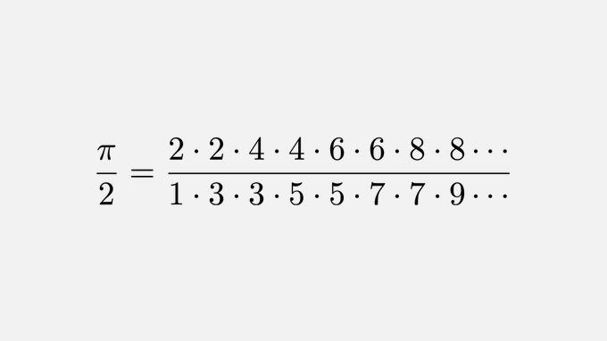

# From John Wallis, 1656




```python
from math import pi
```


```python
upper_bound=100000
```


```python
even,odd=1,1
for i in range(1,upper_bound):
    if i%2==0:
        even=even*i*i
    else:
        flag=i
        odd=odd*i*i    
        
print((even/(odd//flag))*2)
```

    3.141576945508715
    


```python
pi
```


    3.141592653589793


# π for different upper bounds such as 10,100,1000,10000,100000,1000000


```python
print('%-15s %-15s' % ("upper bound","        π"))
for upper_bound in [10,100,1000,10000,100000,1000000]:
    even,odd=1,1
    for i in range(1,upper_bound):
        if i%2==0:
            even=even*i*i
        else:
            flag=i
            odd=odd*i*i    

    print('%-15s %-15s' % (upper_bound,(even/(odd//flag))*2))
print("%-15s %-15s " %("π",pi))
```

    upper bound             π      
    10              2.972154195011338
    100             3.1257662923253897
    1000            3.1400206785767786
    10000           3.1414355621755523
    100000          3.141576945508715
    
