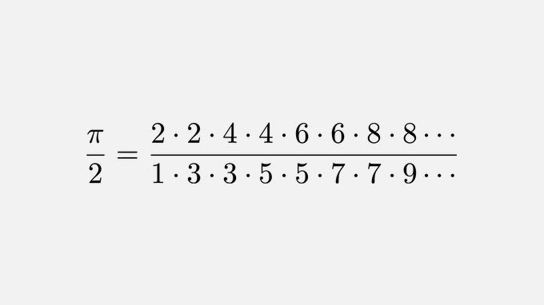

# From John Wallis, 1656




```python
from math import pi
```


```python
upper_limit=100000
```


```python
even,odd=1,1
for i in range(1,upper_limit):
    if i%2==0:
        even=even*i*i
    else:
        flag=i
        odd=odd*i*i    
        
print((even/(odd//flag))*2)
```

    3.141576945508715
    


```python
pi
```


    3.141592653589793


